# Control System
Regulates the behavior of systems using feedback loops. The controller compares the measured values from the plant/model with the reference/desired values to calculate the new input to feed into the plant/model for its measured values to converge to the desired values.

# Plant
A mass spring damper system example\
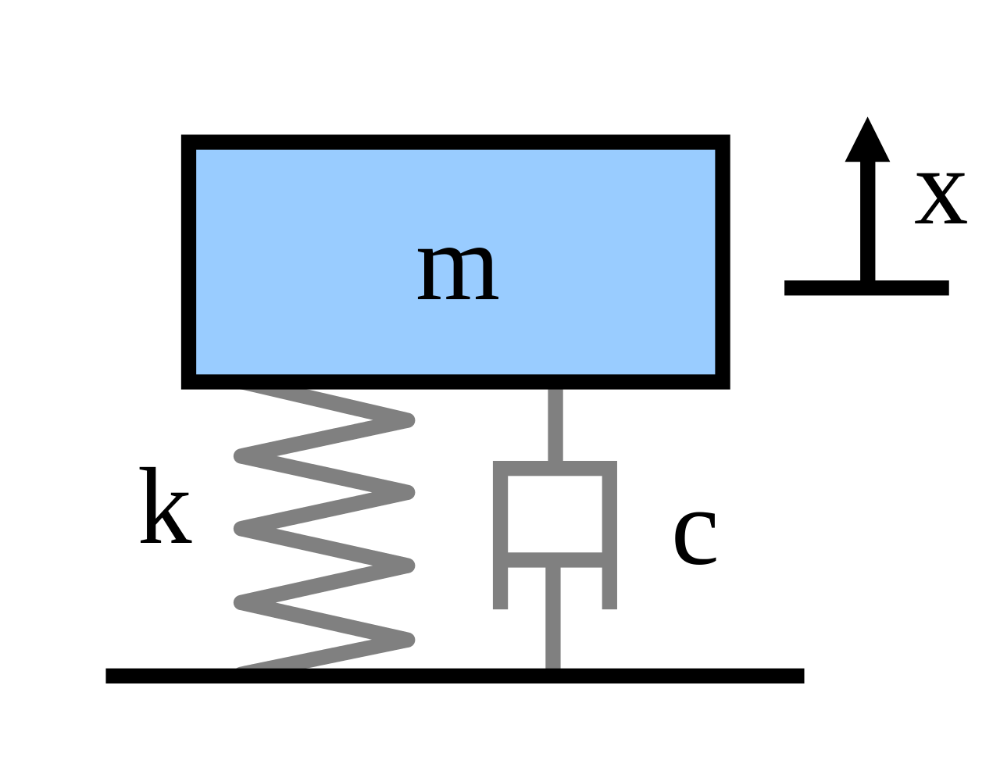\
Free body diagram\
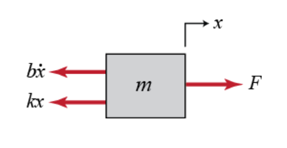\
Resulting force equation

$$\sum F = F(t) - c \dot x(t) - k \dot x(t) = m \ddot x(t)$$

Where F(t) is the external force applied to the mass, c is the damping constant, k is the spring stiffness constant, m is the mass, x is the position of the mass. This systems's input is the external force and the output is the position.

$$m \ddot x = F - x \dot x - k \dot x$$

$$\ddot x = \frac{1}{m} (F - c \dot x - kx)$$

This is a 2nd order differential equation. Higher order differentiate equations can be broken down into many first order differential equations. (Can use lsim or odeint to solve 2nd order diff eq instead of using state space)

# State Space Representation
The most general state space equation of a linear system. Continuous time invariant system.

$$\dot x(t) = Ax(t) + Bu(t)$$

$$y(t) = Cx(t) + Du(t)$$

where
- x is the state vector, n x 1 
- y is the output vector, q x 1
- u is the input/control vector, p x 1
- A is the state/system matrix, n x n
- B is the input matrix, n x p
- C is the output matrix, q x n
- D is the feedforward matrix, q x p

State variables represent a behavior in the system ie coordinates, voltage/current, temperature/pressure, energy. The minimum states required are typically equal to the order of the system's defining differential equation or the denominator order of the transfer function of the system.  

Here we decide the states we care about, the position and the velocity. Therefore, $x_{1} = x, x_{2} = \dot x$

$$\begin{aligned}
X =\
\begin{bmatrix} x_{1} \\\ x_{2} \end{bmatrix}
=\
\begin{bmatrix} x \\\ \dot x \end{bmatrix}
\end{aligned}$$

Using the model equation $\ddot x = \frac{1}{m} (F - c \dot x - kx)$ 

$$\begin{aligned}
\dot X =\
\begin{bmatrix} \dot x_{1} \\\ \dot x_{2} \end{bmatrix}
=\
\begin{bmatrix} \dot x \\\ \ddot x \end{bmatrix}
=\
\begin{bmatrix} x_{2} \\\ \frac{1}{m} (F - cx_{2} -kx_{1}) \end{bmatrix}
\end{aligned}$$

## Continuous Domain
With the form $\dot x = Ax + Bu$

$$\begin{aligned}
\begin{bmatrix} \dot x_{1} \\\ \dot x_{2} \end{bmatrix}
=\
\begin{bmatrix} 0 & 1 \\\ -k/m & -c/m \end{bmatrix}
\begin{bmatrix} x_{1} \\\ x_{2} \end{bmatrix}
+\
\begin{bmatrix} 0 \\\ 1/m \end{bmatrix}
\begin{bmatrix} F \end{bmatrix}
\end{aligned}$$

and want the position to converge to 0 using $y = Cx + Du$

$$\begin{aligned}
\begin{bmatrix} y \end{bmatrix}
=\
\begin{bmatrix} 1 & 0\end{bmatrix}
\begin{bmatrix} x_{1} \\\ x_{2} \end{bmatrix}
+\
\begin{bmatrix} 0 \end{bmatrix}
\begin{bmatrix} F \end{bmatrix}
\end{aligned}$$

## Discrete Domain
With the form $x[k+1] = Ax[k] + Bu[k]$ and $y[k] = Cx[k] + Du[k]$\
Can use approximation

$$\dot x = \frac{x[k+1] - x[k]}{\Delta t}$$

Can substitute back into $\dot x_1 = x_2$ and $\dot x_2 = \frac{1}{m}(F - cx_2 -kx_1)$ equations

$$\begin{aligned}
\frac{x_{1}[k+1] - x_{1}[k]} {\Delta t}
=\
x_{2}[k]
\end{aligned}$$

$$\begin{aligned}
\frac{x_{2}[k+1] - x_{2}[k]} {\Delta t}
=\
\frac{1}{m}(F[k] - cx_{2}[k] - kx_{1}[k])
\end{aligned}$$

---

$$x_1[k+1] = x_1[k] + \Delta t x_2[k]$$

$$x_2[k+1] = x_2[k] + \frac{\Delta t}{m} (F[k] - cx_2[k] - kx_1[k])$$

---

$$x_1[k+1] = x_1[k] + \Delta t x_2[k]$$

$$\begin{aligned}
x_2[k+1]
=\
\frac{-\Delta tk}{m}x_1[k]+ x_2[k] 
+\
\frac{-\Delta tc}{m}x_2[k] + \frac{\Delta t}{m}F[k]
\end{aligned}$$

---

$$x_1[k+1] = x_1[k] + \Delta t x_2[k]$$

$$\begin{aligned}
x_2[k+1]
=\
\frac{-\Delta tk}{m}x_1[k]
+\
(1 - \frac{\Delta tc}{m})x_2[k]
+\
\frac{\Delta t}{m}F[k]
\end{aligned}$$

In state space representation

$$\begin{aligned}
\begin{bmatrix} x_1[k+1] \\\ x_2[k+1] \end{bmatrix}
=\
\begin{bmatrix} 1 & \Delta t \\\ \frac{-\Delta t k}{m} & 1 - \frac{\Delta t c}{m} \end{bmatrix}
\begin{bmatrix} x_1[k] \\\ x_2[k] \end{bmatrix}
+\
\begin{bmatrix} 0 \\\ \frac{\Delta t}{m} \end{bmatrix}
\begin{bmatrix} F[k] \end{bmatrix}
\end{aligned}$$

Output converging position to 0

$$\begin{aligned}
y[k]
=\
\begin{bmatrix} 1 & 0 \end{bmatrix} 
\begin{bmatrix} x_1[k] \\\ x_2[k] \end{bmatrix}
+\
\begin{bmatrix} 0 \end{bmatrix}
\begin{bmatrix} F[k] \end{bmatrix}
\end{aligned}$$

# Open Loop Response
Open loop means having no feedback loop. The reference signal goes straight into the model. The model's transfer function

$$H_p = \frac{1}{s^2 + 10s + 20}$$

When a step signal is used as the input, meaning a constant force of 1N is applied to the mass of 1, the model will behave like\
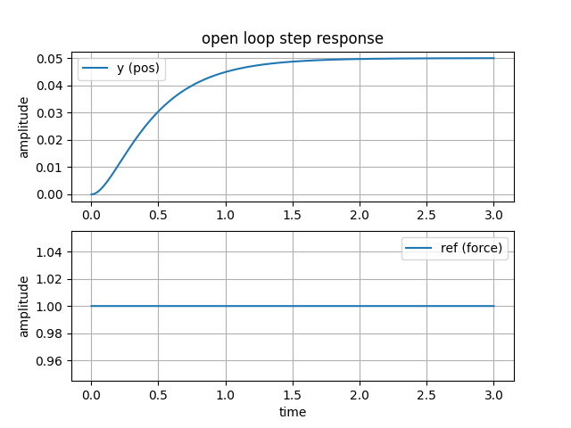\
Can see that the input stays at a constant 1, but the mass cannot reach the position of 1, only converging to 0.05m.
Poles at -7.2j and -2.8j\
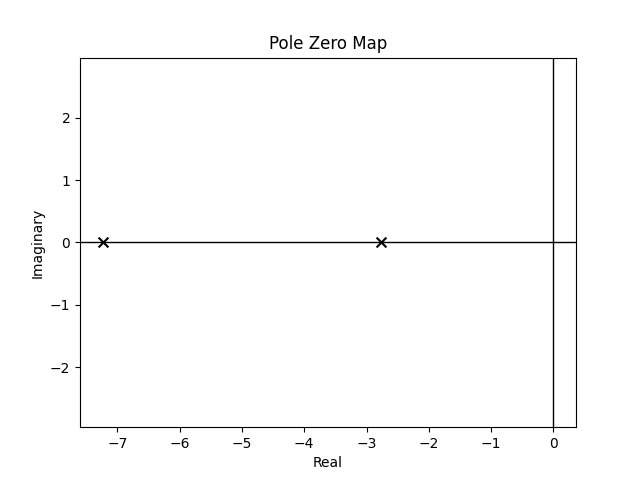\
Can see that the poles also shows that this model converges to 0 and will not oscillate.

When using a larger mass of 10, the model shows oscillations.\
\
\
Can see that a controller is needed to regulate the system so it can reach the desired input values.

# Controller
The are many types of controllers for different types of systems. Controllers are broken down into linear vs nonlinear, time variant vs time invariant, continuous vs discrete, etc. Linear systems follow the superposition principle $F(x_{1} + x_{2}) = F(x_{1}) + F(x_{2})$ and $F(ax) = aF(x)$ Nonlinear system are anything outside of linear system and applies to more real world systems.

# PID
PID controller uses 3 terms, proportional, integral and derivative of the errors. The proportoinal term handles the gain for the error. The integral term handles the steady state error. The derivative term handles the dampening of the error.\
\
By comparing the output value of the plant with the desired value the controller can then determine the amount of input to feed into the system to get the error to converge to 0, output matches input.

Where
- r(t) is the desired input values
- y(t) is the measured output values
- e(t) is the error/difference between output and input
- u(t) is the control input

$$u(t) = K_{p}e(t) + K_{i} \int e(t) + K_{d} \dot e(t)$$

## Continuous Domain
Converting from time domain into s domain with Laplace transform to get the transfer function of a PID controller

$$U(s) = K_p E(s) + K_i \frac{1}{s} E(s) + K_d s E(s)$$

$$\frac{U(s)}{E(s)} = K_p + \frac{K_i}{s} + K_d s$$

## Discrete Domain
Converting from continuous time domain into discontinuous time domain.\
Can be discretized by using

$$\dot f(t_{k}) = \frac{df(t_{k})}{dt} = \frac{f(t_{k}) - f(t_{k-1})}{\Delta t}$$

$$\dot u(t) = K_{k} \dot e(t) + K_{i}e(t) + K_{d} \ddot e(t)$$

Becomes

$$\begin{aligned}
\frac{u(t_{k}) - u(t_{k-1})} {\Delta t} = \
K_{p} \frac{e(t_{k}) - e(t_{k-1})} {\Delta t} + \
K_{i} e(t_{k}) + \
K_{d} \frac{\dot e(t_{k}) - \dot e(t_{k-1})} {\Delta t}
\end{aligned}$$

$$\begin{aligned}
\frac{u(t_{k}) - u(t_{k-1})} {\Delta t} = \
K_{p} \frac{e(t_{k}) - e(t_{k-1})} {\Delta t} + \
K_{i} e(t_{k}) + \
K_{d} \frac{\frac{e(t_{k}) - e(t_{k-1})} {\Delta t} -\frac{e(t_{k-1}) - e(t_{k-2})} {\Delta t}}{\Delta t}
\end{aligned}$$

$$\begin{aligned}
u(t_{k}) - u(t_{k-1}) = \
K_{p} (e(t_{k}) - e(t_{k-1})) + \
K_{i}\Delta t e(t_{k}) + \
\frac{K_{d}} {\Delta t} (e(t_{k}) - 2e(t_{k-1}) + e(t_{k-2}))
\end{aligned}$$

$$\begin{aligned}
u[k] = \
u[k-1] + \
K_{p} e[k] - \
K_{p} e[k-1] + \
K_{i} \Delta t e[k] + \
\frac{K_{d}} {\Delta t} e[k] - \
\frac{K_{d}} {\Delta t} 2e[k-1] + 
\frac{K_{d}} {\Delta t} e[k-2]
\end{aligned}$$

$$\begin{aligned}
u[k] = \
u[k-1] + \
(K_{p} + K_{i} \Delta t + \frac{K_{d}} {\Delta t})e[k] + \
(-K_{p} -2\frac{K_{d}} {\Delta t}) e[k-1] + \
\frac{K_{d}} {\Delta t} e[k-2]
\end{aligned}$$

# Transfer Function
A general image of a feedback control loop.\
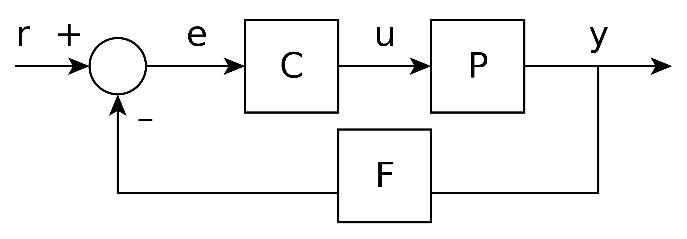

Where
- r is the desired values
- y is the measured values
- e is the error between r and y
- u is the control input
- C is the controller
- P is the model/plant
- F is the sensor

Assuming that this system is linear and time invariant, the Laplace transform of this system becomes.

$$Y(s) = P(s)U(s)$$

$$U(s) = C(s)E(s)$$

$$E(s) = R(s) - F(s)Y(s)$$

Combining the equations gives

$$Y(s) = P(s)C(s)(R(s)-F(s)Y(s))
= P(s)C(s)R(s)-P(s)C(s)F(s)Y(s)$$

$$Y(s)+P(s)C(s)F(s)Y(s) = P(s)C(s)R(s)$$

$$Y(s)(1+P(s)C(s)F(s)) = P(s)C(s)R(s)$$

$$Y(s) = \frac{P(s)C(s)R(s)}{(1+P(s)C(s)F(s))}$$

$$\frac{Y(s)}{R(s)} = \frac{P(s)C(s)}{1+P(s)C(s)F(s)} = H(s)$$

Usually the sensor has a gain of 1 so the transfer function becomes

$$H(s) = \frac{P(s)C(s)}{1+P(s)C(s)}$$

Another way to derive the transfer function using only A, B, C, D with Laplace transform.

$$\dot x(t) = Ax(t) + Bu(t)$$

$$sX(s) - x(0) = AX(s) + BU(s)$$

$$(sI - A)X(s) = x(0) + BU(s)$$

$$X(s) = (sI - A)^{-1}x(0) + (sI - A)^{-1}BU(s)$$

Substituting into the output equation

$$Y(s) = CX(s) + DU(s)$$

$$Y(s) = C((sI - A)^{-1}x(0) + (sI - A)^{-1}BU(s)) + DU(s)$$

Assuming the initial conditions are zero, x(0) = 0

$$Y(s) = C(sI - A)^{-1}BU(s) + DU(s)$$

$$\frac{Y(s)}{U(s)} = C(sI - A)^{-1} + D = H(s)$$

# Poles and Zeros
From the transfer function, poles are when the denominator = 0 and zeros are when the numerator = 0.\
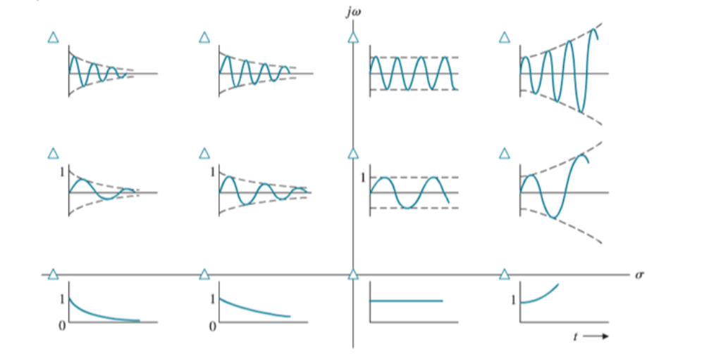\
Poles represent the behavior of a system and zeros represents how the input signal affects the system. Poles and zeros are complex numbers. When poles are closer to the imaginary axis the system doesn't converge or diverge, when the poles are further away from the imaginary axis the more the system converge or diverge. Poles on the left hand side of the plane, the system converges where as on the right hand side the system diverges. When poles are closer to the real axis the system does not oscillates and when the poles goes further away from the real axis the more the system oscillates.

# Close Loop Response
Close loop meaning having a feedback loop from the end to the begining so the controller can modulate its signal to the plant. There is also feedforward loop where a signal/disturbance is fed into the controller beforehand instead of waiting on the output signal to come back.

## Continuous Domain
With a mass of 1\
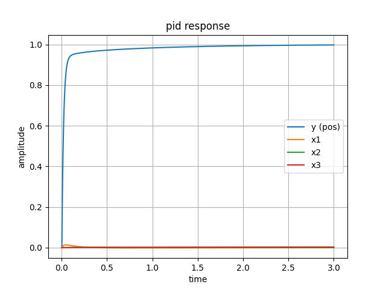\
Can see with a controller regulating the model, the output converges to 1 instead of staying at 0.05. The states x1, x2, x3 are from the combined system of controller and plant so they don't have any physical meaning.\
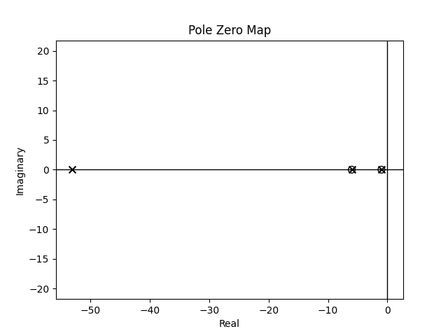\
Can see that the poles are on the negative real axis, the output y converges without oscillation.

With a mass of 10\
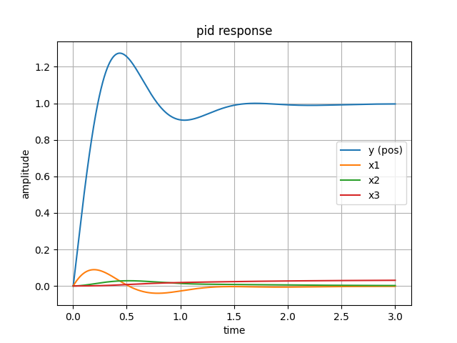\
Can see the output still converges to 1, but has oscillations.\
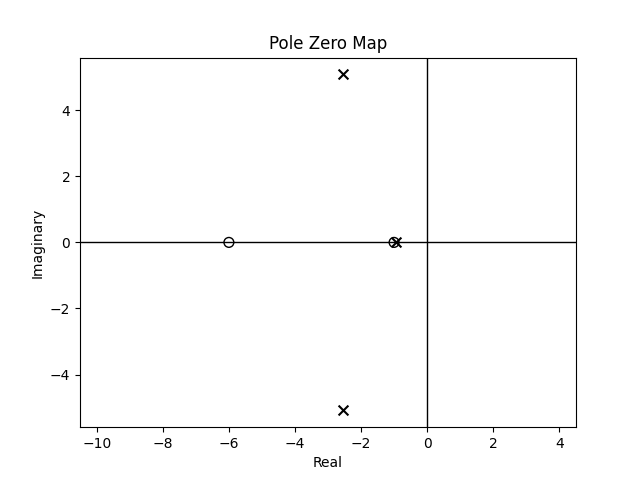\
Can see the poles on the negative complex plane, which results in oscillations on the output.

## Discrete Domain
With a mass of 1\
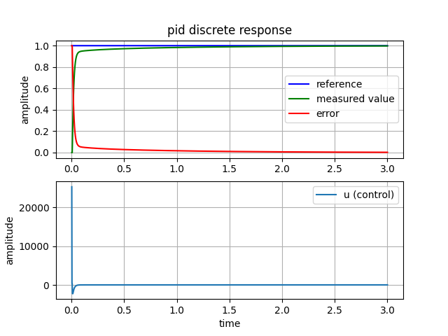\
Can see the output/measured value converges to the reference/desired values of 1 and see that the error signal converges to 0. The u signal/controller signal that drives the model requires a significant high value to start. In a real world application the actuator cannot have such a high value and putting a saturation limit in the code will result in a longer converging time. Can see once the position converges, the actuator stops driving the model.\
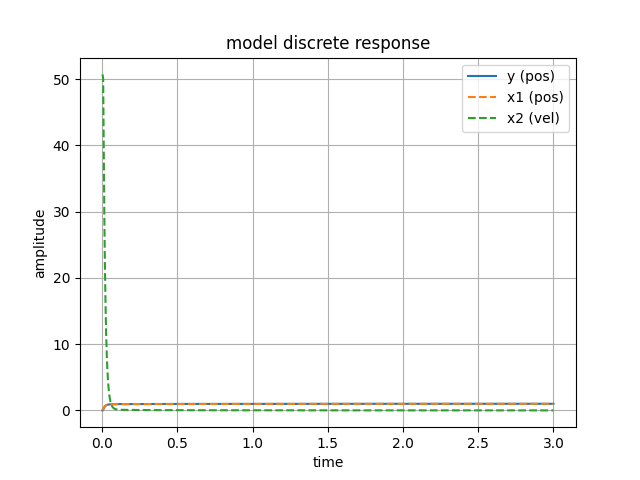\
Can see the states x1 and x2. These states are from the model itself and not from the combined transfer function of the controller and plant; so they have a physical meaning. x1 being the position and x2 is the velocity which was picked by the user in the beginning.

With a mass of 10\
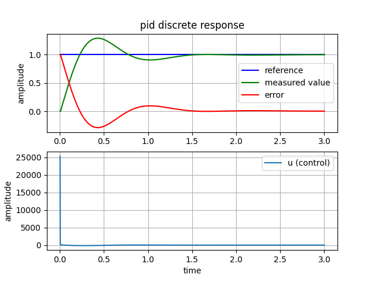\
Can see oscillations in the output and the error signal oscillates in union, and both still converges.\
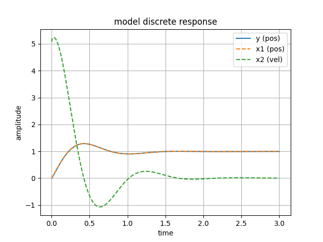\
Can see the output converges to 1, x1 which is the position also matches the output, and x2 which is the velocity starts high and ends on 0 once the position is on target.

# Controllability and Observability
Controllability means there exists a control signal which allows the system to reach any state in a finite amount of time. Controllablity matrix is defined as

$$C = \begin{bmatrix}B & AB & A^2B & ... & A^{n-1}B\end{bmatrix}$$

Where n is the size of the state vector. The system is controllable if it has full row rank, rank(C) = n or linearly independent. If it is not full rank that means the matrix is missing a dimension/information/linearly dependent.

Observability means all states can be derived just from knowing the system outputs (without knowing the input or system states). Observability matrix is defined as

$$O = \begin{bmatrix}C \\\ CA \\\ CA^2 \\\ ... \\\ CA^{n-1}\end{bmatrix}$$

Where n is the size of the state vector. The system is observable if it has full row rank, rank(O) = n.

# Full State Feedback (Tracking)
A feedback method to place the closed loop poles of a plant in user determined locations in the complex plane. Since the poles/eigenvalues of the system determine the response of the system, the user wants to choose where to place the poles.\
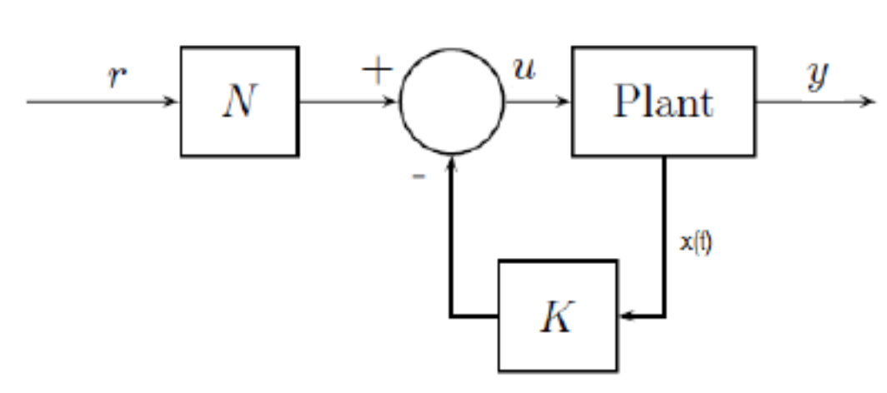

$$\dot x(t) = Ax(t) + Bu(t)$$

$$y(t) = Cx(t) + Du(t)$$

C is chosen to be identity and D = 0

$$y(t) = x(t)$$

The control law is

$$u(t) = rK_r - Kx(t)$$

($K_r$ is N in the picture above) Normally the control law is $u(t) = -Kx(t)$, but am adding a tracking term.

Substituting u into state space

$$\dot x(t) = Ax(t) + B(rK_r - Kx(t))$$

$$\dot x(t) = Ax(t) - BKx(t) + BK_rr$$

$$\dot x(t) = (A - BK)x(t) + BK_rr$$

$A-BK$ becomes the new A system matrix of the close loop system. $BK_r$ becomes the new B system matrix. Since the eigenvalues of the old A matrix is fixed by the model, the new A matrix means the user can move the eigenvalues to desired places by changing the K gain matrix. The eigvalues of new A can be placed anywhere if A, B are controllable.

To find the eigenvalues of a system by its characteristic equation.

$$det\begin{bmatrix}sI - A\end{bmatrix} = 0$$

Finding the eigenvalues of the plant

$$A = \begin{bmatrix} 0 & 1 \\\ -20 & -10\end{bmatrix}$$

$$B = \begin{bmatrix} 0 \\\ 1\end{bmatrix}$$

$$det(sI-A) = 0$$

$$s^2 + 10s + 20 = 0$$

$$s = -5 \pm \sqrt 5$$

$$s = -2.76, -7.24$$

Finding the eigenvalues of the new A where $A_{cl} = A - BK$

$$det\begin{bmatrix}sI - A_{cl}\end{bmatrix} = 0$$

$$s^2 + (K_2+10)s + (K_1+20) = 0$$

The desired chosen poles are -5+2j and -5-2j, complex conjugates.

$$(s+5-2j)(s+5+2j) = 0$$

$$s^2 + 10s + 29 = 0$$

Setting the previous 2 equations equal to each other

$$K_1 + 20 = 29$$

$$K_2 + 10 = 10$$

$K_1 = 9$ and $K_2 = 0$

The control law u(t) = -Kx(t) forces the closed loop poles to the desired locations, so the user can pick the response of the system.

$BK_r$ becomes the new B input vector of the close loop with gain system. Where $K_r$ is the inverse of the dc gain of $A_{cl}$ The DC gain of $A_{cl}$ is 0.0345 so $K_r$ is 29

From the model A, B, C, D; the new system becomes $A_{cl}$, $B_{cl}$, C, D or $A-BK$, $BK_r$, C, D

When the chosen poles are $-5 \pm 2j$ \
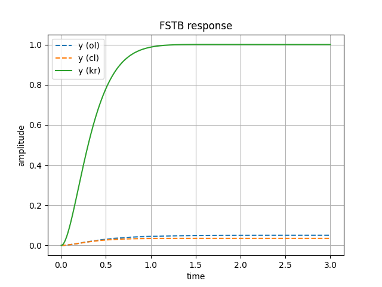\
Can see that the final position output converges to 1\
\
Can see that since the poles are further left the response converges to 0 fast and since the poles are close to the real axis the response does not oscillate.

When the chosen poles are $-2 \pm 5j$\
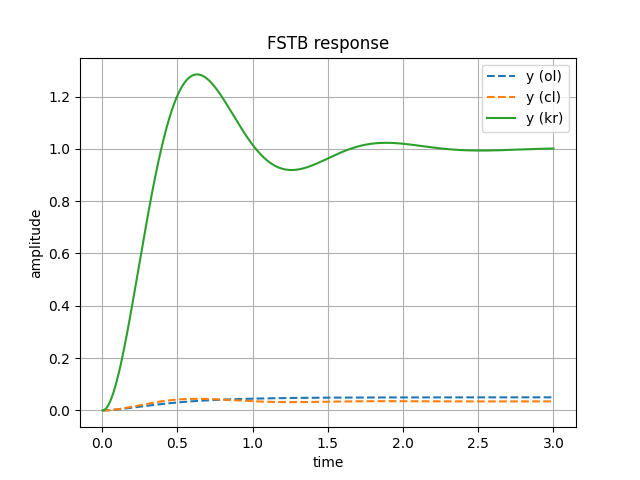\
Can see that the response still converges to 1, but there is oscillations in the output.\
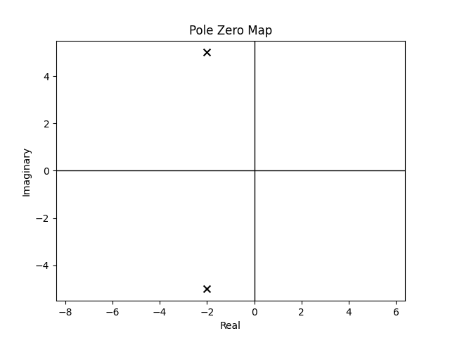\
Can see that since the poles are further away from the real axis the output oscillates and since the poles are closer to the imaginary axis, the output converges slower.

When the chosen poles are $+5 \pm 2j$\
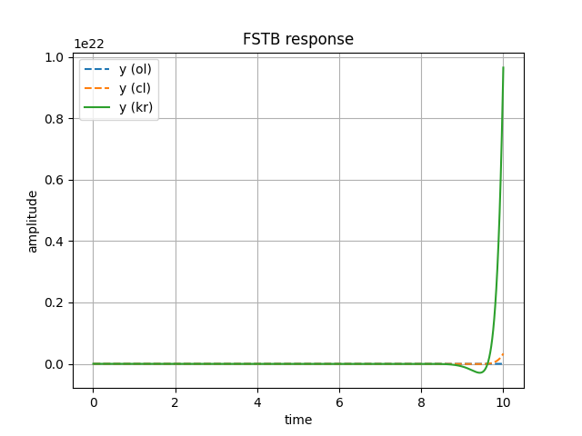\
Can see that the response diverges away from 0, meaning that the system is unstable.\
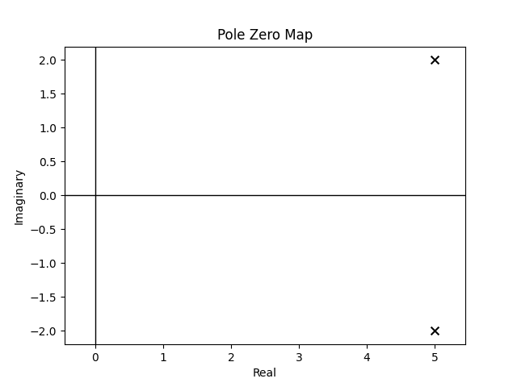\
Can see that since the poles are on the left side of the complex plane, the output is unstable.

# Linear Quadratic Regulator (Tracking)
LQR is a type of optimal controller of a full state feedback and operates the system at a minimum cost. It assumes that the dynamics model is perfect so the solution is optimal, unlike robust controller where the model doesn't have to be perfect.

The cost function

$$J = \int_{0}^{\inf} x^T(t)Qx(t) + u(t)^TRu(t)dt$$

Where
- x(t) is the state vector, nx1
- u(t) is the control vector, mx1
- Q is like a performance matrix, nxn symmetric positive semidefinite matrix
- R is like a effort matrix, mxm symmetric positive definite matrix

Q and R values are weights that penalize the use of the respective states/inputs. Values has to be $Q \ge 0$ and $R > 0$. With high Q values it tells the system to use the least possible change in the state (slow response) or with low values it tells the system to freely use that state (fast response). With high R values means the controller is not allowed to use a lot of actuation signal ie force, voltage, etc. With low R values means the controller is allowed to use a lot of actuation signal. The cost function J has a unique minimum that can be obtained by solving the Algebraic Riccati Equation.

1. State space equations of the model gives A and B

$$\dot x(t) = Ax(t) + Bu(t)$$

$$y = Cx(t) + Du(t)$$

2. Choose the penalizing weights for the states Q and input R

Control law

$$u(t) = -Kx(t) + rK_r$$

3. Find the optimal gain set K. 

$$K = R^{-1}B^TS$$

$K_r$ is to scale the input steady state

Where S is the solution to the Algebraic Ricatti Equation

$$A^TS + SA - SBR^{-1}B^TS + Q = 0$$

4. There might be multiple solutions to K, need to pick one that will give stable system (poles/eigenvalues)

- K is the gain matrix
- S is the ARE solution
- E is the eigenvalues of $A-BK$

Can adjust the behavior of the system by changing the weights for each individual states or inputs instead of arbitrary placing the location of the poles. This is a much more intuitive way to adjust the behavior of the system.

With mass at 10

$$Q = \begin{bmatrix}1 & 0 \\\ 0 & 1\end{bmatrix}$$ 

$$R = 1$$

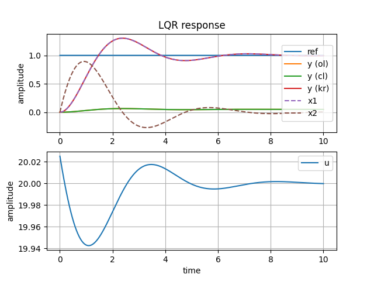\
$y_{kr}$ and x1 signal is position, x2 is velocity. Can see position converges to 1. Control signal u fluctuates around 20.\
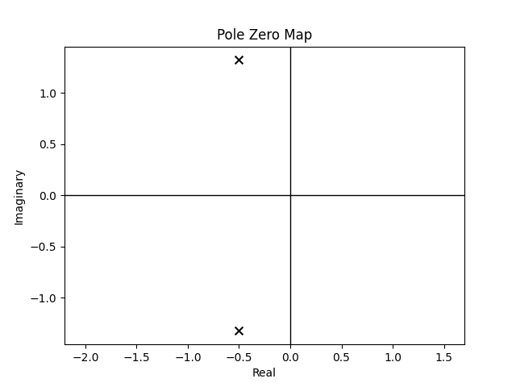\
K = [0.02498439 0.07470535], $K_r = 20$\
Poles at $-0.5 \pm 1.3j$

$$Q = \begin{bmatrix}1000 & 0 \\\ 0 & 1\end{bmatrix}$$

$$R = 1$$

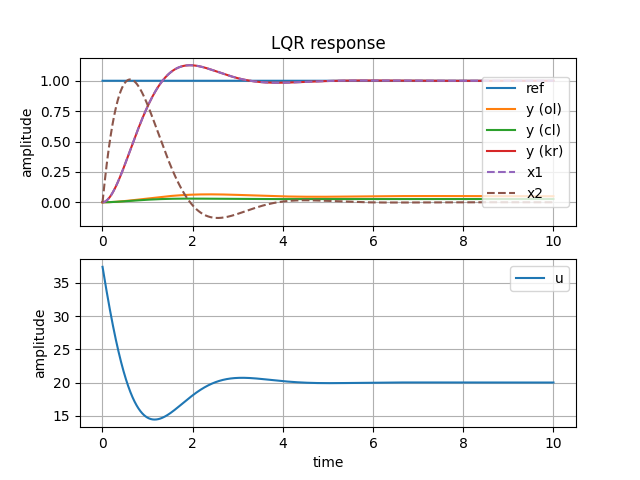\
Having high weight on $Q_{11}$ tells the system to not have a lot of changes to position.\
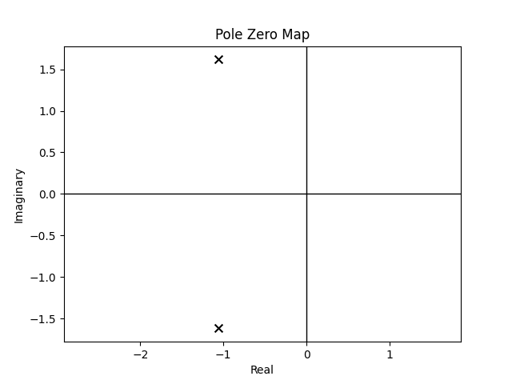\
K = [17.41657387 11.19744035], $K_r = 37.4$\
Poles at $-1.06 \pm 1.6j$

$$Q = \begin{bmatrix}1 & 0 \\\ 0 & 1000\end{bmatrix}$$

$$R = 1$$

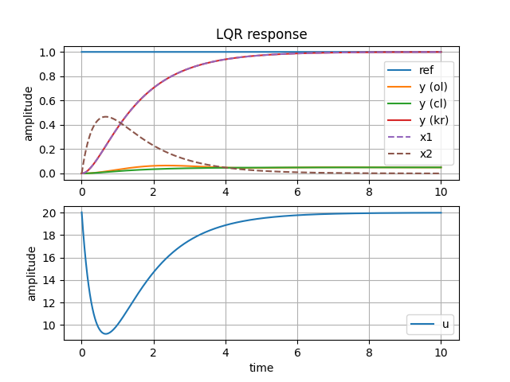\
Having high weight on $Q_{22}$ tells the system to not have a lot of changes in velocity. Can see velocity peaks around 0.5, half of the previous example.\
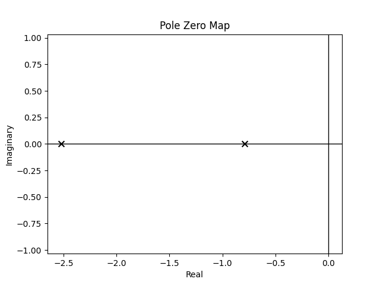\
K = [0.02498439 23.17378013], $K_r = 20$\
Poles at -0.8, -2.5

$$Q = \begin{bmatrix}1 & 0 \\\ 0 & 1\end{bmatrix}$$

$$R = 0.001$$

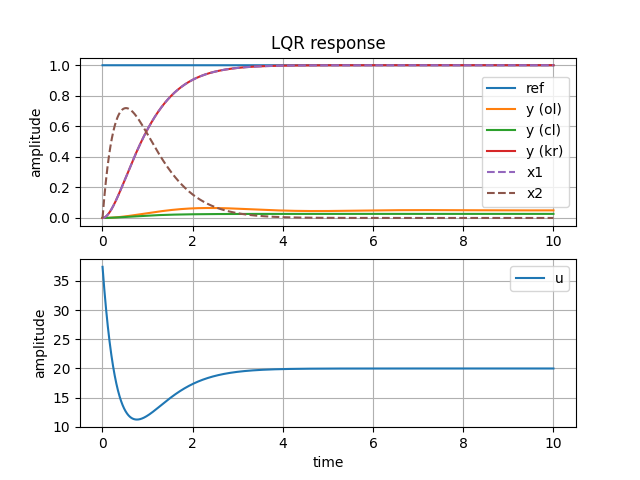\
Having low weight on $R_{1}$ tells the system it is allowed to have high values to actuator signal u.\
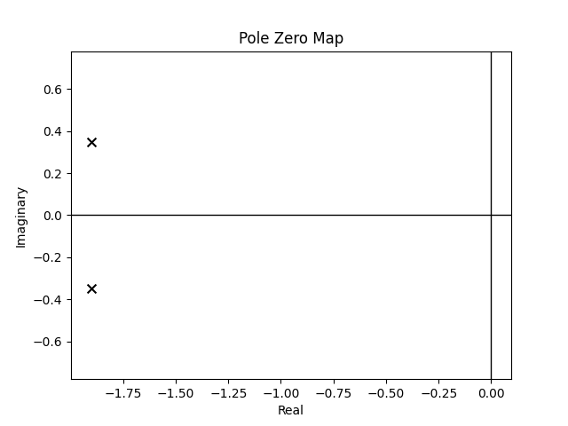\
K = [17.41657387 28.05695045], $K_r = 37.4$\
Poles at $-1.9 \pm 0.35j$

# Full State Observer (Luenberger Observer)
Usually the user will not have the measurements of all the states to a real system. Using the measurements of the input and output of the real system the state observer can estimate all the internal state of the real system.\
\
The equations for the system. Hat means estimations rather than actual.

$$\dot{\hat{x}} = A \hat{x} + Bu + L(y - \hat{y})$$

$$\hat{y} = C \hat{x} + D u$$

---

$$\dot{\hat{x}} = A \hat{x} + Bu + Ly - L \hat{y}$$

Subtituting $\hat{y} = C \hat{x}$, when D = 0

$$\dot{\hat{x}} = A \hat{x} + Bu + Ly - LC \hat{x}$$

$$
\dot{\hat{x}} = (A-LC) \hat{x} + 
\begin{bmatrix}B & L\end{bmatrix}
\begin{bmatrix}u \\\ y\end{bmatrix}
$$

$A-LC$ becomes the new A matrix, $\begin{bmatrix}B & L\end{bmatrix}$ becomes the new B matrix, while $\begin{bmatrix}u \\\ y\end{bmatrix}$ becomes the new u matrix. C can be identity due to knowing all the state estimations and D becomes a matrix of 0s. The system A has given fixed eigvenvalues, and now with A-LC can shift the eigenvalues to any user chosen poles.

To find the eigenvalues of the plant.

$$A = \begin{bmatrix}0 & 1 \\\ -20 & -10\end{bmatrix}$$

$$C = \begin{bmatrix}1 & 0\end{bmatrix}$$

$$det[sI - A] = 0$$

$$s^2 + 10s +20 = 0$$

$$s = -5 \pm \sqrt{5}$$

$$s = -2.76 and -7.24$$

To find the new characteristics of the A matrix where $A-LC$

$$det[sI - (A-LC)] = 0$$

$$s^2 + (10 + L_1)s + (10L_1 + L_2 + 20) = 0$$

The poles chosen to be $-5 \pm 2j$. 

$$(s+5-2j)(s+5+2j) = 0$$

$$s^2 + 10s + 29 = 0$$

The L gain values are

$$10 + L_1 = 10$$

$$10L_1 + L_2 + 20 = 29$$

$$L = \begin{bmatrix}0 \\\ 9\end{bmatrix}$$

Error is defined as $e = x - \hat{x}$

$$\dot{e} = \dot{x} - \dot{\hat{x}}$$

$$\dot{e} = Ax + Bu - A\hat{x} -Bu-Ly + L\hat{y}$$

$$\dot{e} = A(x - \hat{x}) - LCx + LC\hat{x}$$

$$\dot{e} = A(x - \hat{x}) - LC(x-\hat{x})$$

$$\dot{e} = (A-LC)e$$

This shows that the estimation states will converge to the actual states if the eigenvalues of $A-LC$ is on the left side of the complex plane. 

With mass = 10\
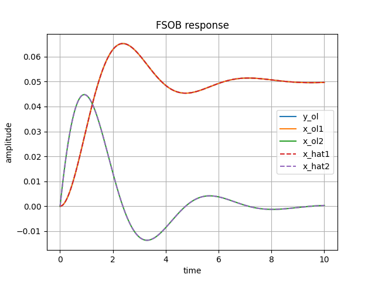\
Can see the estimated states $\hat{x}$ following the actual states x open loop. This example did not introduce disturbances or noise into the model so the estimation model matches the plant model easily. The estimator only took in the input u and output y (position) and can derive all the states including velocity.\
\
Chosen poles to be $-5 \pm 2j$

With mass = 10 and initial conditions of 

$$x_0 = \begin{bmatrix}0.5 \\\ -0.5\end{bmatrix}$$

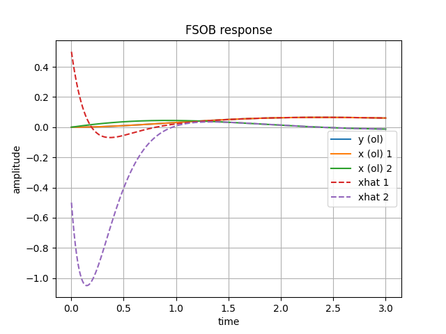\
Can see with arbitrary picked initial conditions the estimated states will still converge to the true states.\
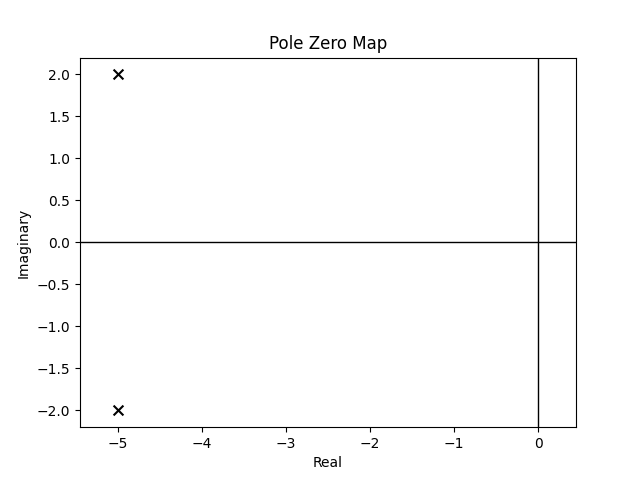\
Chosen poles to be $-5 \pm 2j$

With mass = 10 and initial conditions of 

$$x_0 = \begin{bmatrix}0.5 \\\ -0.5\end{bmatrix}$$

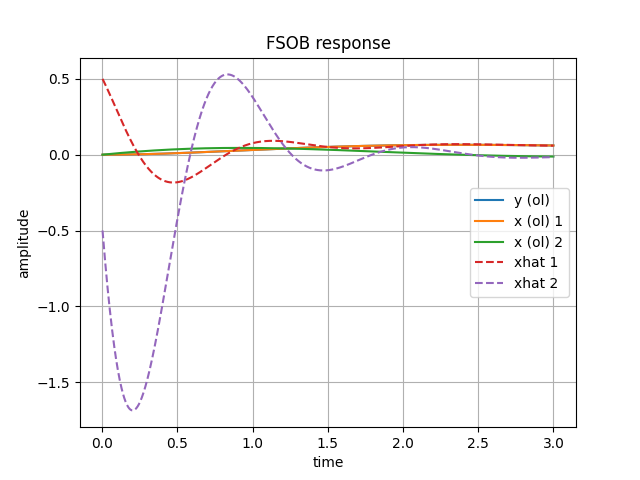\
With poorly chosen poles, the estimated states becomes more oscillatory.\
\
Chosen poles to be $-2 \pm 5j$

With mass = 10 and initial conditions of 

$$x_0 = \begin{bmatrix}0.5 \\\ -0.5\end{bmatrix}$$

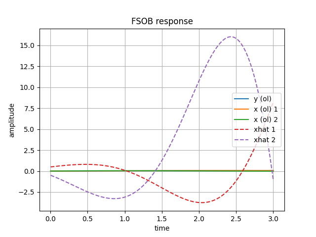\
Can see the estimated states diverge from true states due to unstable poles\
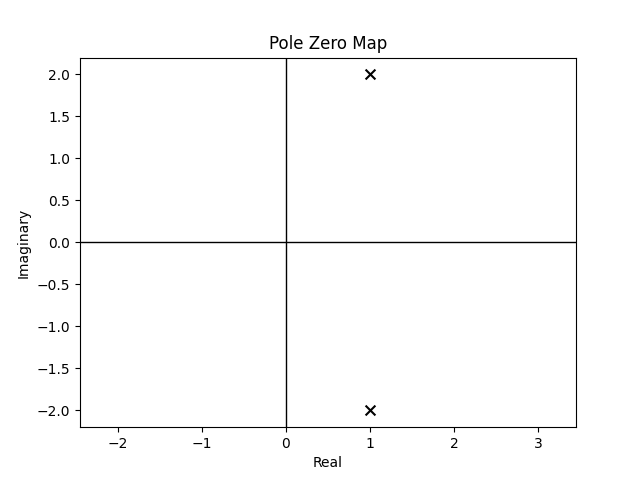\
Chosen poles to be $1 \pm 2j$

# Linear Quadratic Estimator (Kalman Filter)
Kalman filter is the optimal variant of the full state observer where the gain L is calculated based off minimizing the cost function.

The cost function

$$J = \int_{0}^{\inf} x^T(t)Qx(t) + u(t)^T Ru(t)dt$$

Where
- x(t) is the state vector, nx1
- u(t) is the control vector, mx1
- Q is like a performance matrix, nxn symmetric positive semidefinite matrix
- R is like a effort matrix, mxm symmetric positive definite matrix

Q(Vd) and R(Vn) values are weights/uncertainty covariances that penalize the use of the respective disturbance and noise. Values has to be $Q \ge 0$ and $R > 0$. Having high values in Q tells the system that it has high amounts of disturbance (therefore the system should value the measurement signal more) and low values in Q means that it has low disturbance (therefore the system should value the model signal more). High values in R tells the system it has high amount of noise vs low values means that it has low amounts of noise. The cost function J has a unique minimum that can be obtained by solving the Algebraic Riccati Equation. Optimal estimator gain L is $L = PC^TV^{-1}$ where P is $AP + PA^T - PC^TV^{-1}CP + W = 0$

Gain L can be calculated with the Algebraic Riccati Equation. When using a model with no disturbance and noise, the kalman filter has no problem following the actual states.\
With $V_d = \begin{bmatrix}0.1 & 0 \\\ 0 & 0.1\end{bmatrix}$, $V_n = 1$, mass = 10\
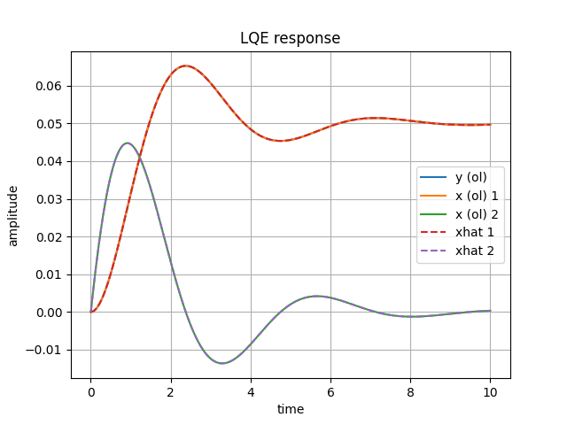\
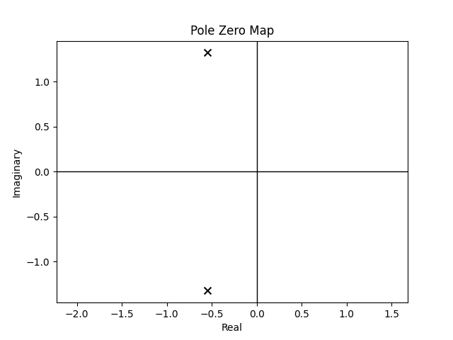\
The gain is optimal at L = [[ 0.09488826], [-0.04549811]]

Model with process noise(disturbance) and measurement noise

$$\dot{x} = Ax + Bu + W$$

$$y = Cx + V$$

where W is the process noise, $W = Vd*d$ and V is the measurement noise, $V = Vn*n$

$$\dot{x} = Ax + Bu + V_d d + 0n$$

$$\dot{x} = Ax + \begin{bmatrix}B & V_d & 0\end{bmatrix} \begin{bmatrix}u \\\ d \\\ n\end{bmatrix}$$

and the output

$$y = Cx + Du + 0*d + V_n n$$

$$y = Cx + \begin{bmatrix}D & 0 & V_n\end{bmatrix} \begin{bmatrix}u \\\ d \\\ n\end{bmatrix}$$

With $V_d = \begin{bmatrix}0.1 & 0 \\\ 0 & 0.1\end{bmatrix}$, $V_n = 1$, mass = 10\
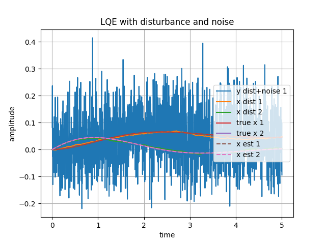\
Can see that the estimated states (x est) are closely following the actual states (true x) even though the state observer is fed with a signal with both disturbance and noise (y dist+noise). Signal with only disturbance is (x dist).

With $V_d = \begin{bmatrix}1 & 0 \\\ 0 & 0.1\end{bmatrix}$, $V_n = 1$, mass = 10\
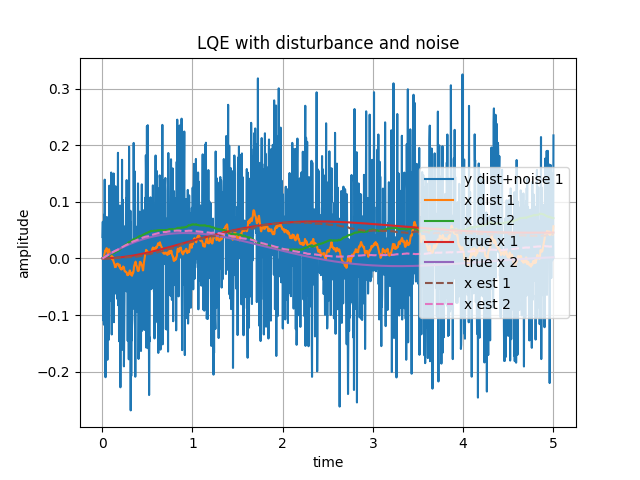\
When $V_{d11} = 1$ the position signal is being weighted more to the measurement side so the noise becomes more prominant. The estimated state strays further from the true state and closer to the disturbance state.

With $V_d = \begin{bmatrix}0.1 & 0 \\\ 0 & 1\end{bmatrix}$, $V_n = 1$, mass = 10\
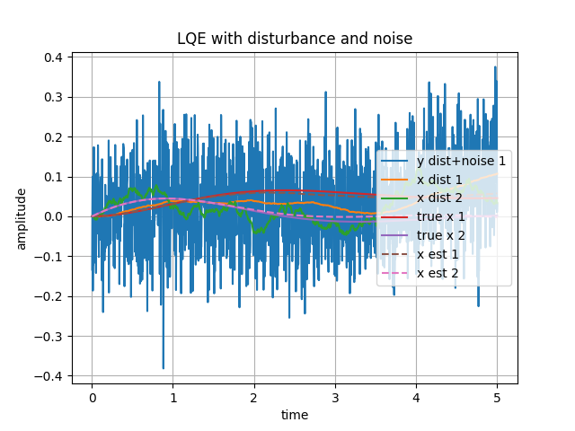\
When $V_{d22} = 1$ the velocity signal is being weighted more to the measurement side so the noise becomes more prominant. The estimated state strays further from the true state and closer to the disturbance state.

# Linear Quadratic Gaussian
A combination of LQR and LQE to optimally control a system. It assumes the process noise and measurement noise are guassian. Usually the user will not have all the state measurements from the output so the output y and input u is fed into the LQE to estimate all the states of the system. Since the LQE has a perfect model of the system, it can take in noisy output and filter out nearly all the noise. The estimated states are then fed into the LQR as it requires access to all the states to produce a feedback loop to the system.\
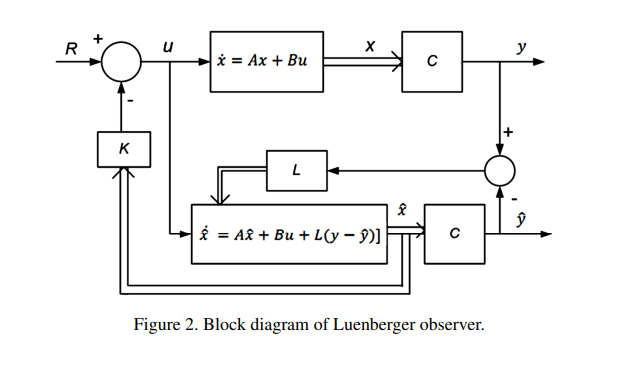

The state space equations

$$\dot{x} = Ax + Bu$$

$$y = Cx + Du$$

control law with estimated states

$$u = -k \hat{x} + K_r r$$

observer equations

$$\dot{\hat{x}} = A \hat{x} + Bu + L(y- \hat{y})$$

$$\hat{y} = C \hat{x} + Du$$

Error is defined to be $e = x - \hat{x}$, the difference between actual states and estimated states.

---

Substituting u in

$$\dot{x} = Ax - BK \hat{x} + BK_r r$$

Sutstituting $\hat{x} = x - (x - \hat{x})$

$$\dot{x} = Ax - BKx + BK(x-\hat{x}) + BK_r r$$

$$\dot{x} = (A-BK)x + BKe + BK_r r$$

using $\dot{e} = \dot{x} - \dot{\hat{x}}$

$$\dot{e} = Ax + Bu - A\hat{x} - Bu -Ly + L\hat{y}$$

$$\dot{e} = A(x - \hat{x}) - LCx + LC\hat{x}$$

$$\dot{e} = A(x - \hat{x}) - LC(x-\hat{x})$$

$$\dot{e} = (A-LC)e$$

The new system states becomes

$$\begin{aligned}
\begin{bmatrix}\dot{x} \\\ \dot{e}\end{bmatrix} =\
\begin{bmatrix}A-BK & BK \\\ 0 & A-LC\end{bmatrix}
\begin{bmatrix}x \\\ e \end{bmatrix} +\
\begin{bmatrix}BK_r \\\ 0\end{bmatrix}
\begin{bmatrix}r\end{bmatrix}
\end{aligned}$$

$$\begin{aligned}
y =\
\begin{bmatrix}C & 0\end{bmatrix}
\begin{bmatrix}x \\\ e\end{bmatrix} +\
\begin{bmatrix}D\end{bmatrix}
\begin{bmatrix}r\end{bmatrix}
\end{aligned}$$

The new states now includes position, velocity, the difference between actual and estimated position, and the difference between actual and estimated velocity.

With mass = 10, $V_d = \begin{bmatrix}0.1 & 0 \\\ 0 & 0.1\end{bmatrix}$, $V_n = 1$, $Q = \begin{bmatrix}1 & 0 \\\ 0 & 1\end{bmatrix}$, $R = 1$ \
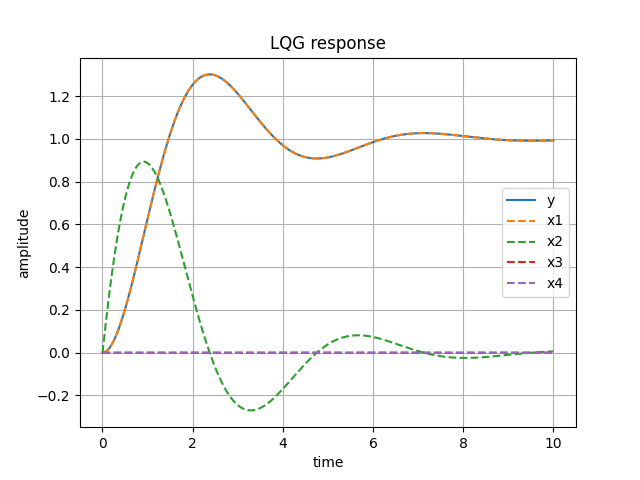\
Can see the position (x1) follows the output (y) at desired reference of 1. The velocity (x2) starts high due to moving mass and ends up at 0 when the position is at desired location. The position and velocity errors are at 0 due to the observer deriving the actual states as the plant model and observer model are the same (no disturbance or nosie).

Modeling with disturbance and noise\
The state space equations

$$\dot{x} = Ax + Bu + W$$

$$y = Cx + V$$

control law u with reference tracking

$$u = -k\hat{x} + K_r r$$

observer equation

$$\dot{\hat{x}} = A\hat{x} + Bu + L(y - \hat{y})$$

identity substitution $\hat{x} = x - (x - \hat{x})$

Disturbance and noise being modeled as $W = V_d * d$ and $V = V_n * n$

error e is defined as $e = x - \hat{x}$

Becomes

$$\dot{x} = Ax - BK\hat{x} + BK_r r + W$$

$$\dot{x} = Ax - BKx + BK(x-\hat{x}) + BK_r r + W$$

$$\dot{x} = (A-BK)x + BKe + BK_r r + V_d*d$$

augmented with e

$$\dot{x} = \dot{x} - \dot{\hat{x}}$$

$$\dot{x} = Ax + Bu + W - A\hat{x} - Bu -Ly + L\hat{y}$$

$$\dot{x} = A(x-\hat{x}) + W - LCx - LV + LC\hat{x}$$

$$\dot{x} = A(x-\hat{x}) - LC(x-\hat{x}) + W - LV$$

$$\dot{x} = (A-LC)e + V_d*d - L(V_n*n)$$

In state space matrix form

$$\begin{aligned}
\begin{bmatrix}\dot{x} \\\ \dot{e}\end{bmatrix} = \
\begin{bmatrix}A-BK & BK \\\ 0 & A-LC\end{bmatrix}
\begin{bmatrix}x \\\ e\end{bmatrix} + \
\begin{bmatrix}BK_r & V_d & 0 \\\ 0 & V_d & -LV_n\end{bmatrix}
\begin{bmatrix}r \\\ d \\\ n\end{bmatrix}
\end{aligned}$$

matrix y

$$\begin{aligned}
y = \
\begin{bmatrix}C & 0\end{bmatrix}
\begin{bmatrix}x \\\ e\end{bmatrix} + \
\begin{bmatrix}0 & 0 & V_n\end{bmatrix}
\begin{bmatrix}r \\\ d \\\ n\end{bmatrix}
\end{aligned}$$

With mass = 10, $V_d = \begin{bmatrix}0.1 & 0 \\\ 0 & 0.1\end{bmatrix}$, $V_n = 1$, $Q = \begin{bmatrix}1 & 0 \\\ 0 & 1\end{bmatrix}$, $R = 1$ \
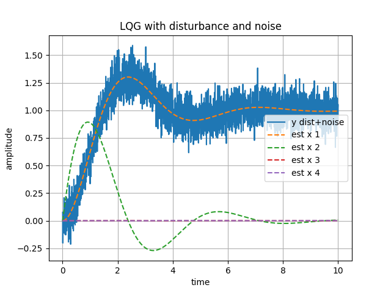\
Can see the position signal y with model disturbance and sensor noise. Only this signal is being used by the observer. The observer has the measurements of reference, y (noisy), and ideal model dynamics. It is able to filter out the noise and also derive all states; shown in estimated x1 (position) and x2 (velocity). Estimated state x3 and x4 are the error between true states and estimated states which should be close to 0. Once the full state estimates is derived from the observer, they are given to the full state feedback for converging to the reference value.

# References
[KaTex](https://katex.org/docs/supported.html) Markup used by github\
[Control Tutorial](https://ctms.engin.umich.edu/CTMS/index.php?aux=Home) for matlab/simulink by CMU\
[PID](https://en.wikipedia.org/wiki/PID_controller) wiki\
[LQR](https://www.youtube.com/playlist?list=PLn8PRpmsu08podBgFw66-IavqU2SqPg_w) by matlab\
[Control Tutorial](https://www.youtube.com/playlist?list=PLMrJAkhIeNNR20Mz-VpzgfQs5zrYi085m) by Steve Brunton
