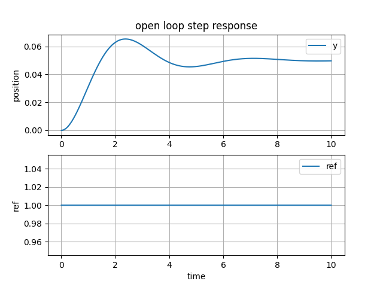

# Control System
Reglates the behavior of systems using feedback loops. The controller compares the measured values from the plant with the reference values to calculate the new input to feed into the plant for its output to converge to the refernce values.

# Plant
A mass spring damper system example\
\
Free body diagram\
\
Resulting force equation

$$\sum F = F(t) - c \dot x(t) - k \dot x(t) = m \ddot x(t)$$

Where F(t) is the external force applied to the mass, c is the damping constant, k is the spring stiffness constant, m is the mass, x is the position of the mass. This systems's input is the external force and the output is the position.

$$m \ddot x = F - x \dot x - k \dot x$$

$$\ddot x = \frac{1}{m} (F - c \dot x - kx)$$

This is a 2nd order differential equation. Higher order differentiate equations can be broken down into many first order differential equations. (Can use lsim or odeint to solve 2nd order diff eq instead of using state space)

# State Space Representation
The most general state space equation of a linear system. Continuous time invariant system.

$$\dot x(t) = Ax(t) + Bu(t)$$

$$y(t) = Cx(t) + Du(t)$$

where
- x is the state vector, n x 1 
- y is the output vector, q x 1
- u is the input/control vector, p x 1
- A is the state/system matrix, n x n
- B is the input matrix, n x p
- C is the output matrix, q x n
- D is the feedforward matrix, q x p

State variables represent a behavior in the system ie coordinates, voltage/current, temperature/pressure, energy. The minimum states required are typically equal to the order of the system's defining differential equation or the denominator order of the transfer function of the system.  

Here we decide the states we care about, the position and the velocity. Therefore, $x_{1} = x, x_{2} = \dot x$

$$\begin{aligned}
X =\
\begin{bmatrix} x_{1} \\\ x_{2} \end{bmatrix}
=\
\begin{bmatrix} x \\\ \dot x \end{bmatrix}
\end{aligned}$$

Using the model equation $\ddot x = \frac{1}{m} (F - c \dot x - kx)$ 

$$\begin{aligned}
\dot X =\
\begin{bmatrix} \dot x_{1} \\\ \dot x_{2} \end{bmatrix}
=\
\begin{bmatrix} \dot x \\\ \ddot x \end{bmatrix}
=\
\begin{bmatrix} x_{2} \\\ \frac{1}{m} (F - cx_{2} -kx_{1}) \end{bmatrix}
\end{aligned}$$

## Continuous Domain
With the form $\dot x = Ax + Bu$

$$\begin{aligned}
\begin{bmatrix} \dot x_{1} \\\ \dot x_{2} \end{bmatrix}
=\
\begin{bmatrix} 0 & 1 \\\ -k/m & -c/m \end{bmatrix}
\begin{bmatrix} x_{1} \\\ x_{2} \end{bmatrix}
+\
\begin{bmatrix} 0 \\\ 1/m \end{bmatrix}
\begin{bmatrix} F \end{bmatrix}
\end{aligned}$$

and want the position to converge to 0 using $y = Cx + Du$

$$\begin{aligned}
\begin{bmatrix} y \end{bmatrix}
=\
\begin{bmatrix} 1 & 0\end{bmatrix}
\begin{bmatrix} x_{1} \\\ x_{2} \end{bmatrix}
+\
\begin{bmatrix} 0 \end{bmatrix}
\begin{bmatrix} F \end{bmatrix}
\end{aligned}$$

## Discrete Domain
With the form $x[k+1] = Ax[k] + Bu[k]$ and $y[k] = Cx[k] + Du[k]$\
Can use approximation

$$\dot x = \frac{x[k+1] - x[k]}{\Delta t}$$

Can substitute back into $\dot x_1 = x_2$ and $\dot x_2 = \frac{1}{m}(F - cx_2 -kx_1)$ equations

$$\begin{aligned}
\frac{x_{1}[k+1] - x_{1}[k]} {\Delta t}
=\
x_{2}[k]
\end{aligned}$$

$$\begin{aligned}
\frac{x_{2}[k+1] - x_{2}[k]} {\Delta t}
=\
\frac{1}{m}(F[k] - cx_{2}[k] - kx_{1}[k])
\end{aligned}$$

---

$$x_1[k+1] = x_1[k] + \Delta t x_2[k]$$

$$x_2[k+1] = x_2[k] + \frac{\Delta t}{m} (F[k] - cx_2[k] - kx_1[k])$$

---

$$x_1[k+1] = x_1[k] + \Delta t x_2[k]$$

$$\begin{aligned}
x_2[k+1]
=\
\frac{-\Delta tk}{m}x_1[k]+ x_2[k] 
+\
\frac{-\Delta tc}{m}x_2[k] + \frac{\Delta t}{m}F[k]
\end{aligned}$$

---

$$x_1[k+1] = x_1[k] + \Delta t x_2[k]$$

$$\begin{aligned}
x_2[k+1]
=\
\frac{-\Delta tk}{m}x_1[k]
+\
(1 - \frac{\Delta tc}{m})x_2[k]
+\
\frac{\Delta t}{m}F[k]
\end{aligned}$$

In state space representation

$$\begin{aligned}
\begin{bmatrix} x_1[k+1] \\\ x_2[k+1] \end{bmatrix}
=\
\begin{bmatrix} 1 & \Delta t \\\ \frac{-\Delta t k}{m} & 1 - \frac{\Delta t c}{m} \end{bmatrix}
\begin{bmatrix} x_1[k] \\\ x_2[k] \end{bmatrix}
+\
\begin{bmatrix} 0 \\\ \frac{\Delta t}{m} \end{bmatrix}
\begin{bmatrix} F[k] \end{bmatrix}
\end{aligned}$$

Output converging position to 0

$$\begin{aligned}
y[k]
=\
\begin{bmatrix} 1 & 0 \end{bmatrix} 
\begin{bmatrix} x_1[k] \\\ x_2[k] \end{bmatrix}
+\
\begin{bmatrix} 0 \end{bmatrix}
\begin{bmatrix} F[k] \end{bmatrix}
\end{aligned}$$

# Open Loop Response
Open loop means having no feedback loop. The reference signal goes straight into the model. The model's transfer function

$$H_p = \frac{1}{s^2 + 10s + 20}$$

When a step signal is used as the input, meaning a constant force of 1N is applied to the mass of 1, the model will behave like\
\
Can see that the input stays at a constant 1, but the mass cannot reach the position of 1, only converging to 0.05m.
Poles at -7.2j and -2.8j\
\
Can see that the poles also shows that this model converges to 0 and will not oscillate.\

When using a larger mass of 10, the model shows oscillations .
\
\
Can see that a controller is needed to regulate the system so it can reach the desired input values.

# Controller
The are many types of controllers for different types of systems. Controllers are broken down into linear vs nonlinear, time variant vs time invariant, continuous vs discrete, etc. Linear systems follow the superposition principle $F(x_{1} + x_{2}) = F(x_{1}) + F(x_{2})$ and $F(ax) = aF(x)$ Nonlinear system are anything outside of linear system and applies to more real world systems.

# PID
PID controller uses 3 terms, proportional, integral and derivative of the errors. The proportoinal term handles the gain for the error. The integral term handles the steady state error. The derivative term handles the dampening of the error.\
\
By comparing the output value of the plant with the desired value the controller can then determine the amount of input to feed into the system to get the error to converge to 0, output matches input.

Where
- r(t) is the desired input values
- y(t) is the measured output values
- e(t) is the error/difference between output and input
- u(t) is the control input

$$u(t) = K_{p}e(t) + K_{i} \int e(t) + K_{d} \dot e(t)$$

## Continuous Domain
Converting from time domain into s domain with Laplace transform to get the transfer function of a PID controller

$$U(s) = K_p E(s) + K_i \frac{1}{s} E(s) + K_d s E(s)$$

$$\frac{U(s)}{E(s)} = K_p + \frac{K_i}{s} + K_d s$$

## Discrete Domain
Converting from continuous time domain into discontinuous time domain.\
Can be discretized by using

$$\dot f(t_{k}) = \frac{df(t_{k})}{dt} = \frac{f(t_{k}) - f(t_{k-1})}{\Delta t}$$

$$\dot u(t) = K_{k} \dot e(t) + K_{i}e(t) + K_{d} \ddot e(t)$$

Becomes

$$\begin{aligned}
\frac{u(t_{k}) - u(t_{k-1})} {\Delta t}
=\
K_{p} \frac{e(t_{k}) - e(t_{k-1})} {\Delta t}
+\
K_{i} e(t_{k})
+\
K_{d} \frac{\dot e(t_{k}) - \dot e(t_{k-1})} {\Delta t}
\end{aligned}$$

$$\begin{aligned}
\frac{u(t_{k}) - u(t_{k-1})} {\Delta t}
=\
K_{p} \frac{e(t_{k}) - e(t_{k-1})} {\Delta t}
+\
K_{i} e(t_{k})
+\
K_{d} \frac{\frac{e(t_{k}) - e(t_{k-1})} {\Delta t} -\frac{e(t_{k-1}) - e(t_{k-2})} {\Delta t}}{\Delta t}
\end{aligned}$$

$$\begin{aligned}
u(t_{k}) - u(t_{k-1})
=\
K_{p} (e(t_{k}) - e(t_{k-1}))
+\
K_{i}\Delta t e(t_{k})
+\
\frac{K_{d}} {\Delta t}
(e(t_{k}) - 2e(t_{k-1}) + e(t_{k-2}))
\end{aligned}$$

$$\begin{aligned}
u[k]
=\
u[k-1]
+\
K_{p} e[k]
-\
K_{p} e[k-1]
+\
K_{i} \Delta t e[k]
+\
\frac{K_{d}} {\Delta t} e[k]
-\
\frac{K_{d}} {\Delta t} 2e[k-1]
+\
\frac{K_{d}} {\Delta t} e[k-2]
\end{aligned}$$

$$\begin{aligned}
u[k]
=\
u[k-1]
+\
(K_{p} + K_{i} \Delta t + \frac{K_{d}} {\Delta t})e[k]
+\
(-K_{p} -2\frac{K_{d}} {\Delta t}) e[k-1]
+\
\frac{K_{d}} {\Delta t} e[k-2]
\end{aligned}$$

# Transfer Function
A general image of a feedback control loop.\


Where
- r is the desired values
- y is the measured values
- e is the error between r and y
- u is the control input
- C is the controller
- P is the model/plant
- F is the sensor

Assuming that this system is linear and time invariant, the Laplace transform of this system becomes.

$$Y(s) = P(s)U(s)$$

$$U(s) = C(s)E(s)$$

$$E(s) = R(s) - F(s)Y(s)$$

Combining the equations gives

$$Y(s) = P(s)C(s)(R(s)-F(s)Y(s))
= P(s)C(s)R(s)-P(s)C(s)F(s)Y(s)$$

$$Y(s)+P(s)C(s)F(s)Y(s) = P(s)C(s)R(s)$$

$$Y(s)(1+P(s)C(s)F(s)) = P(s)C(s)R(s)$$

$$Y(s) = \frac{P(s)C(s)R(s)}{(1+P(s)C(s)F(s))}$$

$$\frac{Y(s)}{R(s)} = \frac{P(s)C(s)}{1+P(s)C(s)F(s)} = H(s)$$

Usually the sensor has a gain of 1 so the transfer function becomes

$$H(s) = \frac{P(s)C(s)}{1+P(s)C(s)}$$

Another way to derive the transfer function using only A, B, C, D with Laplace transform.

$$\dot x(t) = Ax(t) + Bu(t)$$

$$sX(s) - x(0) = AX(s) + BU(s)$$

$$(sI - A)X(s) = x(0) + BU(s)$$

$$X(s) = (sI - A)^{-1}x(0) + (sI - A)^{-1}BU(s)$$

Substituting into the output equation

$$Y(s) = CX(s) + DU(s)$$

$$Y(s) = C((sI - A)^{-1}x(0) + (sI - A)^{-1}BU(s)) + DU(s)$$

Assuming the initial conditions are zero, x(0) = 0

$$Y(s) = C(sI - A)^{-1}BU(s) + DU(s)$$

$$\frac{Y(s)}{U(s)} = C(sI - A)^{-1} + D = H(s)$$

# Poles and Zeros
From the transfer function, poles are when the denominator = 0 and zeros are when the numerator = 0.\
\
Poles represent the behavior of a system and zeros represents how the input signal affects the system. Poles and zeros are complex numbers. When poles are on the left real axis the system converges to 0, when poles are on the origin the system stays unmoving, and when the poles are on the right real axis the system diverges from 0. When poles are on the origin the system stays unmovings and when the poles goes further out on the imaginary axis the more the system oscillates.

# Close Loop Response
Close loop meaning having a feedback loop from the end to the begining so the controller can modulate its signal to the plant. There is also feedforward loop where a signal/disturbance is fed into the controller beforehand instead of waiting on the output signal to come back.

## Continuous Domain
With a mass of 1\
\
Can see with a controller regulating the model, the output converges to 1 instead of staying at 0.05. The states x1, x2, x3 are from the combined system of controller and plant so they don't have any physical meaning.\
\
Can see that the poles are on the negative real axis, the output y converges without oscillation.

With a mass of 10\
\
Can see the output still converges to 1, but has oscillations.\
\
Can see the poles on the negative complex plane, which results in oscillations on the output.

## Discrete Domain
With a mass of 1\

Can see the output/measured value converges to the reference/desired values of 1 and see that the error signal converges to 0. The u signal/controller signal that drives the model requires a significant high value to start. In a real world application the actuator cannot have such a high value and putting a saturation limit in the code will result in a longer converging time. Can see once the position converges, the actuator stops driving the model.\
\
Can see the states x1 and x2. These states are from the model itself and not from the combined transfer function of the controller and plant; so they have a physical meaning.

With a mass of 10\
\
Can see oscillations in the output and the error signal oscillates in union, and both still converges.\
\
Can see the output converges to 1, x1 which is the position also matches the output, and x2 which is the velocity starts high and ends on 0 once the position is on target.

# Full State Feedback

# Controllability and Observability

# Linear Quadratic Regulator

# References
[KaTex](https://katex.org/docs/supported.html) Markup used by github

When $a \ne 0$, there are two solutions to $(ax^2 + bx + c = 0)$ and they are 
$$ x = {-b \pm \sqrt{b^2-4ac} \over 2a} $$
```bash
x is the state vector
```
$$\begin{bmatrix}
a & b \\
c & d
\end{bmatrix}$$

$$\begin{bmatrix} \end{bmatrix}$$
