# Linear Quadratic Regulator (Tracking)
LQR is a type of optimal controller of a full state feedback and operates the system at a minimum cost. It assumes that the dynamics model is perfect so the solution is optimal, unlike robust controller where the model doesn't have to be perfect.

The cost function

$$ J = \int_{0}^{\inf} x^T(t)Qx(t) + u(t)^TRu(t)dt $$

Where
- x(t) is the state vector, nx1
- u(t) is the control vector, mx1
- Q is like a performance matrix, nxn symmetric positive semidefinite matrix
- R is like a effort matrix, mxm symmetric positive definite matrix

Q and R values are weights that penalize the use of the respective states/inputs. Values has to be $Q \ge 0$ and $R > 0$. With high Q values it tells the system to use the least possible change in the state (slow response) or with low values it tells the system to freely use that state (fast response). With high R values means the controller is not allowed to use a lot of actuation signal ie force, voltage, etc. With low R values means the controller is allowed to use a lot of actuation signal. The cost function J has a unique minimum that can be obtained by solving the Algebraic Riccati Equation.

1. State space equations of the model gives A and B

$$ \dot x(t) = Ax(t) + Bu(t) $$

$$ y = Cx(t) + Du(t) $$

2. Choose the penalizing weights for the states Q and input R

Control law

$$ u(t) = -Kx(t) + rK_r $$

3. Find the optimal gain set K. 

$$ K = R^{-1}B^TS $$

$K_r$ is to scale the input steady state

Where S is the solution to the Algebraic Ricatti Equation

$$ A^TS + SA - SBR^{-1}B^TS + Q = 0 $$

4. There might be multiple solutions to K, need to pick one that will give stable system (poles/eigenvalues)

- K is the gain matrix
- S is the ARE solution
- E is the eigenvalues of $A-BK$

Can adjust the behavior of the system by changing the weights for each individual states or inputs instead of arbitrary placing the location of the poles. This is a much more intuitive way to adjust the behavior of the system.

With mass at 10

$$ Q = \begin{bmatrix} 1 & 0 \\\ 0 & 1 \end{bmatrix} $$

$$ R = 1 $$

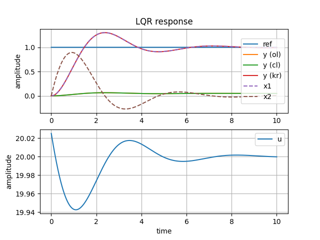\
$y_{kr}$ and x1 signal is position, x2 is velocity. Can see position converges to 1. Control signal u fluctuates around 20.\
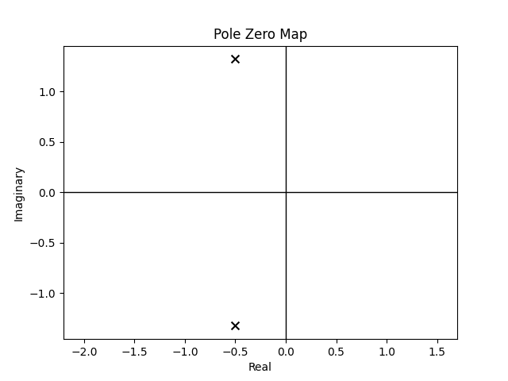\
K = [0.02498439 0.07470535], $K_r = 20$\
Poles at $-0.5 \pm 1.3j$

$$ Q = \begin{bmatrix} 1000 & 0 \\\ 0 & 1 \end{bmatrix} $$

$$ R = 1 $$

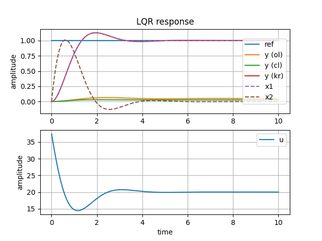\
Having high weight on $Q_{11}$ tells the system to not have a lot of changes to position.\
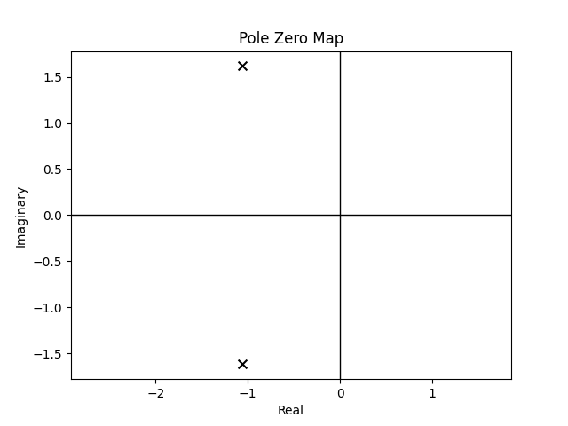\
K = [17.41657387 11.19744035], $K_r = 37.4$\
Poles at $-1.06 \pm 1.6j$

$$ Q = \begin{bmatrix} 1 & 0 \\\ 0 & 1000 \end{bmatrix} $$

$$ R = 1 $$

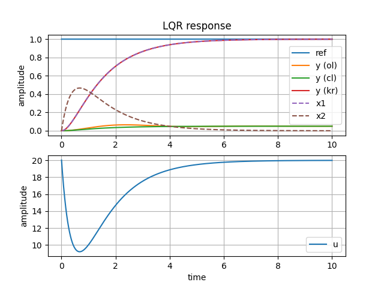\
Having high weight on $Q_{22}$ tells the system to not have a lot of changes in velocity. Can see velocity peaks around 0.5, half of the previous example.\
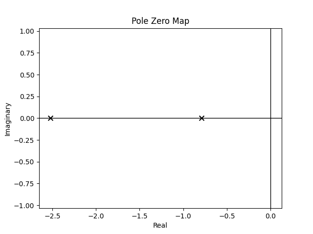\
K = [0.02498439 23.17378013], $K_r = 20$\
Poles at -0.8, -2.5

$$ Q = \begin{bmatrix} 1 & 0 \\\ 0 & 1 \end{bmatrix} $$

$$ R = 0.001 $$

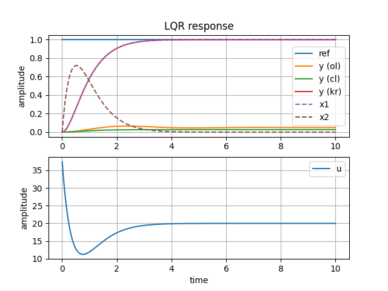\
Having low weight on $R_{1}$ tells the system it is allowed to have high values to actuator signal u.\
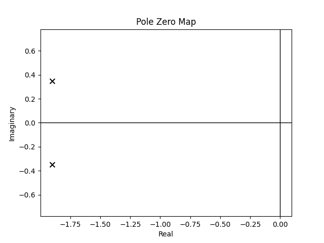\
K = [17.41657387 28.05695045], $K_r = 37.4$\
Poles at $-1.9 \pm 0.35j$

# Linear Quadratic Estimator
Kalman filter is the optimal variant of the full state observer where the gain L is calculated based off minimizing the cost function.

The cost function

$$ J = \int_{0}^{\inf} x^T(t)Qx(t) + u(t)^T Ru(t)dt $$

Where
- x(t) is the state vector, nx1
- u(t) is the control vector, mx1
- Q is like a performance matrix, nxn symmetric positive semidefinite matrix
- R is like a effort matrix, mxm symmetric positive definite matrix

Q(Vd) and R(Vn) values are weights/uncertainty covariances that penalize the use of the respective disturbance and noise. Values has to be $Q \ge 0$ and $R > 0$. Having high values in Q tells the system that it has high amounts of disturbance (therefore the system should value the measurement signal more) and low values in Q means that it has low disturbance (therefore the system should value the model signal more). High values in R tells the system it has high amount of noise vs low values means that it has low amounts of noise. The cost function J has a unique minimum that can be obtained by solving the Algebraic Riccati Equation. Optimal estimator gain L is $L = PC^TV^{-1}$ where P is $AP + PA^T - PC^TV^{-1}CP + W = 0$

Gain L can be calculated with the Algebraic Riccati Equation. When using a model with no disturbance and noise, the kalman filter has no problem following the actual states.

With mass = 10

$$ V_d = \begin{bmatrix}0.1 & 0 \\\ 0 & 0.1\end{bmatrix} $$

$$ V_n = 1 $$

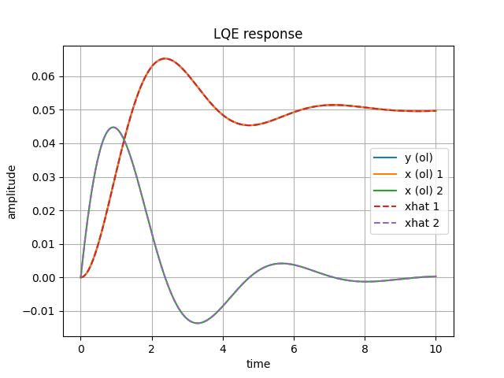\
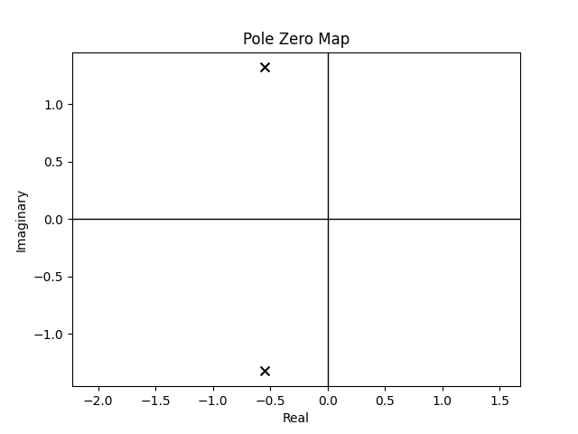\
The gain is optimal at L = [[ 0.09488826], [-0.04549811]]

Model with process noise(disturbance) and measurement noise

$$ \dot{x} = Ax + Bu + W $$

$$ y = Cx + Du + V $$

where W is the process noise, 

$$ W = Vd*d $$

and V is the measurement noise, 

$$ V = Vn*n $$

$$ \dot{x} = Ax + Bu + V_d d + 0n $$

$$ \dot{x} = Ax + \begin{bmatrix}B & V_d & 0\end{bmatrix} \begin{bmatrix}u \\\ d \\\ n\end{bmatrix} $$

and the output

$$ y = Cx + Du + 0*d + V_n n $$

$$ y = Cx + \begin{bmatrix}D & 0 & V_n\end{bmatrix} \begin{bmatrix}u \\\ d \\\ n\end{bmatrix} $$

With mass = 10

$$ V_d = \begin{bmatrix}0.1 & 0 \\\ 0 & 0.1\end{bmatrix} $$

$$ V_n = 1 $$

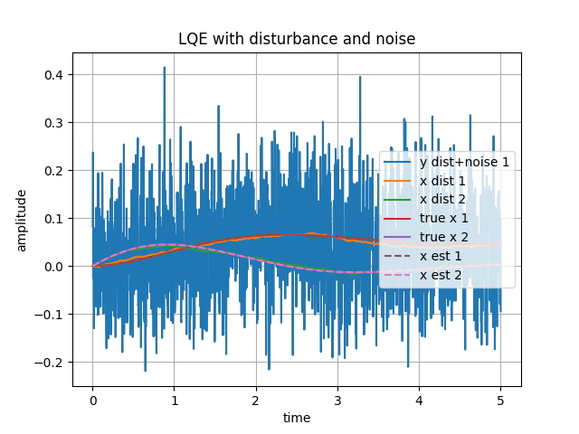\
Can see that the estimated states (x est) are closely following the actual states (true x) even though the state observer is fed with a signal with both disturbance and noise (y dist+noise). Signal with only disturbance is (x dist).

With mass = 10

$$ V_d = \begin{bmatrix}1 & 0 \\\ 0 & 0.1\end{bmatrix} $$

$$ V_n = 1 $$

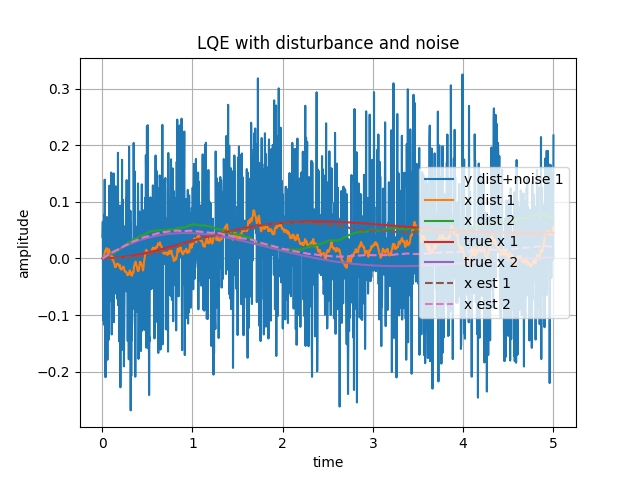\
When $V_{d11} = 1$ the position signal is being weighted more to the measurement side so the noise becomes more prominant. The estimated state strays further from the true state and closer to the disturbance state.

With mass = 10

$$ V_d = \begin{bmatrix}0.1 & 0 \\\ 0 & 1\end{bmatrix} $$

$$ V_n = 1 $$

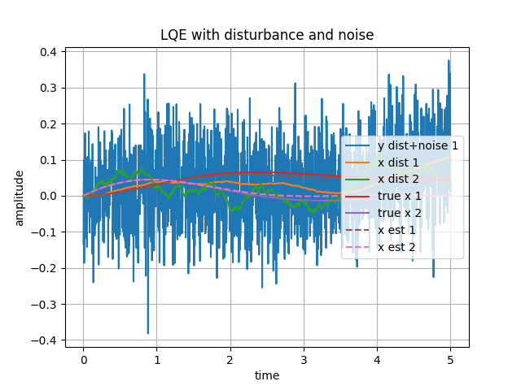\
When $V_{d22} = 1$ the velocity signal is being weighted more to the measurement side so the noise becomes more prominant. The estimated state strays further from the true state and closer to the disturbance state.

# Linear Quadratic Gaussian
A combination of LQR and LQE to optimally control a system. It assumes the process noise and measurement noise are guassian. Usually the user will not have all the state measurements from the output so the output y and input u is fed into the LQE to estimate all the states of the system. Since the LQE has a perfect model of the system, it can take in noisy output and filter out nearly all the noise. The estimated states are then fed into the LQR as it requires access to all the states to produce a feedback loop to the system.
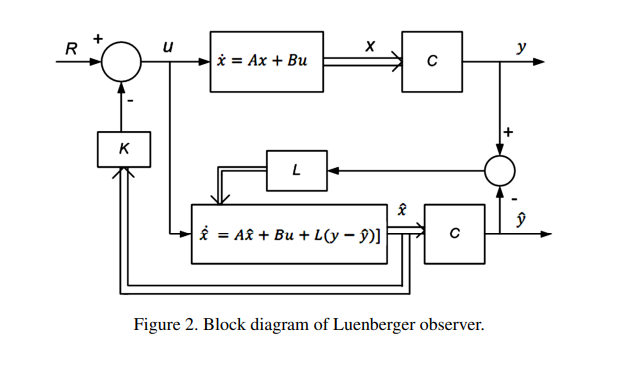

With mass = 10

$$ V_d = \begin{bmatrix} 0.1 & 0 \\\ 0 & 0.1 \end{bmatrix} $$

$$ V_n = 1 $$

$$ Q = \begin{bmatrix} 1 & 0 \\\ 0 & 1 \end{bmatrix} $$

$$ R = 1 $$

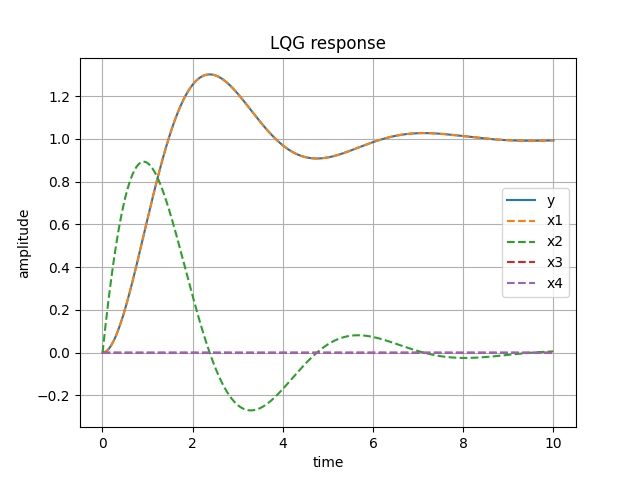\
Can see the position (x1) follows the output (y) at desired reference of 1. The velocity (x2) starts high due to moving mass and ends up at 0 when the position is at desired location. The position and velocity errors are at 0 due to the observer deriving the actual states as the plant model and observer model are the same (no disturbance or nosie).

Modeling with disturbance and noise N($\mu, \sigma^2$)
- w ~ N(0, Vd)
- v ~ N(0, Vn)

N stands for normal gaussian distribution with mean = 0, and variance of Vd and Vn.

$$ \sigma = sqrt(variance) $$

Small model variance means the model is accurate. Large variance means the model is not accurate. Small measurement variance means sensors are accurate. Large variance means sensors are too noisy.

The model state space equations with process and sensor noise

$$ \dot{x} = Ax + Bu + W $$

$$ y = Cx + Du + V $$

Control law u with reference tracking

$$ u = -k\hat{x} + K_r r $$

Observer equation

$$ \dot{\hat{x}} = A\hat{x} + Bu + L(y - \hat{y}) $$

Identity substitution $\hat{x} = x - (x - \hat{x})$

Disturbance/process noise modeled as $W = V_d * d$ and measurement noise modeled as $V = V_n * n$

error e is defined as $e = x - \hat{x}$

Substituting u into model equations becomes

$$ \dot{x} = Ax - BK\hat{x} + BK_r r + W $$

$$ \dot{x} = Ax - BKx + BK(x-\hat{x}) + BK_r r + W $$

$$ \dot{x} = (A-BK)x + BKe + BK_r r + V_d*d $$

---

Substituting model and observer equations into $\dot{e}$

$$ \dot{e} = \dot{x} - \dot{\hat{x}} $$

$$ \dot{e} = Ax + Bu + W - A\hat{x} - Bu -Ly + L\hat{y} $$

$$ \dot{e} = A(x-\hat{x}) + W - LCx - LV + LC\hat{x} $$

$$ \dot{e} = A(x-\hat{x}) - LC(x-\hat{x}) + W - LV $$

$$ \dot{e} = (A-LC)e + V_d*d - L(V_n*n) $$

---

The combined state space matrix form

$$
\begin{aligned}
\begin{bmatrix} \dot{x} \\\ \dot{e} \end{bmatrix} =
\begin{bmatrix} A-BK & BK \\\ 0 & A-LC \end{bmatrix}
\begin{bmatrix} x \\\ e \end{bmatrix} +
\begin{bmatrix} BK_r & V_d & 0 \\\ 0 & V_d & -LV_n \end{bmatrix}
\begin{bmatrix} r \\\ d \\\ n \end{bmatrix}
\end{aligned}
$$

$$
\begin{aligned} y =
\begin{bmatrix} C & 0 \end{bmatrix}
\begin{bmatrix} x \\\ e \end{bmatrix} +
\begin{bmatrix} D & 0 & V_n \end{bmatrix}
\begin{bmatrix} r \\\ d \\\ n \end{bmatrix}
\end{aligned}
$$

With mass = 10

$$ V_d = \begin{bmatrix} 0.1 & 0 \\\ 0 & 0.1 \end{bmatrix} $$

$$ V_n = 1 $$

$$ Q = \begin{bmatrix} 1 & 0 \\\ 0 & 1 \end{bmatrix} $$

$$ R = 1 $$

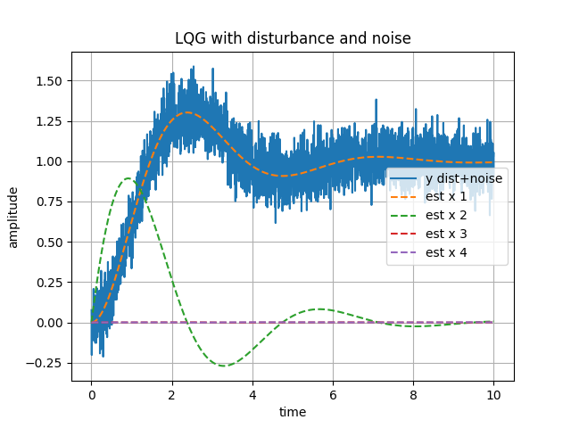\
Can see the position signal y with model disturbance and sensor noise. Only this signal is being used by the observer. The observer has the measurements of reference, y (noisy), and ideal model dynamics. It is able to filter out the noise and also derive all states; shown in estimated x1 (position) and x2 (velocity). Estimated state x3 and x4 are the error between true states and estimated states which should be close to 0. Once the full state estimates is derived from the observer, they are given to the full state feedback for converging to the reference value.
