# Controllability and Observability
Controllability means there exists a control signal which allows the system to reach any state in a finite amount of time. Controllablity matrix is defined as

$$ C = \begin{bmatrix} B & AB & A^2B & ... & A^{n-1}B \end{bmatrix} $$

Where n is the size of the state vector. The system is controllable if it has full row rank, rank(C) = n or linearly independent (det(C) != 0). If it is not full rank that means the matrix is missing a dimension/information/linearly dependent. For example a car can be moved anywhere with inputs from the wheel and pedals.

Observability means all states can be derived just from knowing the system outputs (without knowing the input or system states). Observability matrix is defined as

$$ O = \begin{bmatrix} C \\\ CA \\\ CA^2 \\\ ... \\\ CA^{n-1} \end{bmatrix} $$

Where n is the size of the state vector. The system is observable if it has full row rank, rank(O) = n or det(O) != 0. For example a car's states can observed from the daskboard, but some states like amount of fuel cannot be directly controlled by wheel/pedals.

# Full State Feedback (Tracking)
A feedback method to place the closed loop poles of a plant in user determined locations in the complex plane. Since the poles/eigenvalues of the system determine the response of the system, the user wants to choose where to place the poles.\
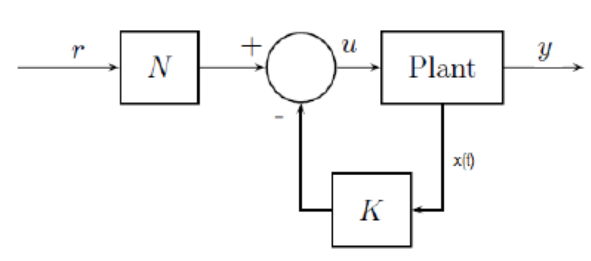

$$ \dot x(t) = Ax(t) + Bu(t) $$

$$ y(t) = Cx(t) + Du(t) $$

C is chosen to be identity and D = 0

$$ y(t) = x(t) $$

The control law is

$$ u(t) = rK_r - Kx(t) $$

($K_r$ is N in the picture above) Normally the control law is $u(t) = -Kx(t)$, but am adding a tracking term.

Substituting u into state space

$$ \dot x(t) = Ax(t) + B(rK_r - Kx(t)) $$

$$ \dot x(t) = Ax(t) - BKx(t) + BK_rr $$

$$ \dot x(t) = (A - BK)x(t) + BK_rr $$

$$ [A-B*K] $$
becomes the new A system matrix of the close loop system. 

$$ [B*K_r] $$
becomes the new B system matrix.

Since the eigenvalues of the old A matrix is fixed by the model, the new A matrix means the user can move the eigenvalues to desired places by changing the K gain matrix. The eigvalues of new A can be placed anywhere if A, B are controllable.

$$ rank(ctrb(A, B)) = 2 $$
therefore the system in controllable.

To find the eigenvalues of a system by its characteristic equation.

$$ det\begin{bmatrix} sI - A \end{bmatrix} = 0 $$

Finding the eigenvalues of the plant

$$ A = \begin{bmatrix} 0 & 1 \\\ -20 & -10 \end{bmatrix} $$

$$ B = \begin{bmatrix} 0 \\\ 1 \end{bmatrix} $$

$$ det(sI-A) = 0 $$

$$ det(\begin{bmatrix} s & 0 \\\ 0 & s \end{bmatrix} - \begin{bmatrix} 0 & 1 \\\ -20 & -10 \end{bmatrix}) = 0 $$

$$ s^2 + 10s + 20 = 0 $$

$$ s = -5 \pm \sqrt 5 $$

$$ s = -2.76, -7.24 $$

Finding the eigenvalues of the new A where $A_{cl} = A - BK$

$$ det\begin{bmatrix} sI - A_{cl} \end{bmatrix} = 0 $$

$$ det\begin{bmatrix} s & 0 \\\ 0 & s \end{bmatrix} - \begin{bmatrix} 0 & 1 \\\ -k_{1} -20 & -k_{2} - 10 \end{bmatrix} $$

$$ s^2 + (K_2+10)s + (K_1+20) = 0 $$

The desired chosen poles are -5+2j and -5-2j, complex conjugates.

$$ (s+5-2j)(s+5+2j) = 0 $$

$$ s^2 + 10s + 29 = 0 $$

Setting the previous 2 equations equal to each other

$$ K_1 + 20 = 29 $$

$$ K_2 + 10 = 10 $$

$$ K = \begin{bmatrix} K_{1} & K_{2} \end{bmatrix} = \begin{bmatrix} 9 & 0 \end{bmatrix} $$

The control law $u(t) = -Kx(t)$ forces the closed loop poles to the desired locations, so the user can pick the response of the system.

$K_rB$ becomes the new B input vector of the close loop with gain system. Example with mass = 1. Where $K_r$ is the inverse of the dc gain of $A_{cl}$ The DC gain of $A_{cl}$ is 0.0345 so $K_r$ is 29

From the model A, B, C, D; the new system becomes $A_{cl}$, $B_{cl}$, C, D or $A-BK$, $BK_r$, C, D

When the chosen poles are $-5 \pm 2j$\
\
Can see that the final position output converges to 1\
\
Can see that since the poles are further left the response converges to 0 fast and since the poles are close to the real axis the response does not oscillate.

When the chosen poles are $-2 \pm 5j$\
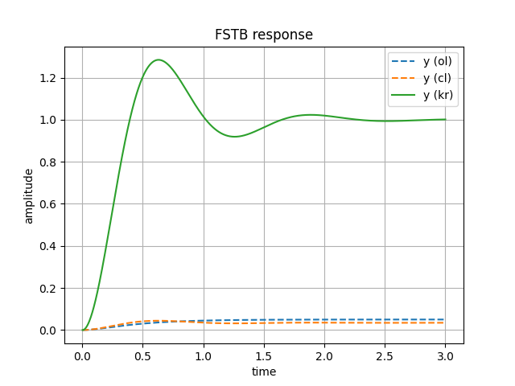\
Can see that the response still converges to 1, but there is oscillations in the output.\
\
Can see that since the poles are further away from the real axis the output oscillates and since the poles are closer to the imaginary axis, the output converges slower.

When the chosen poles are $+5 \pm 2j$\
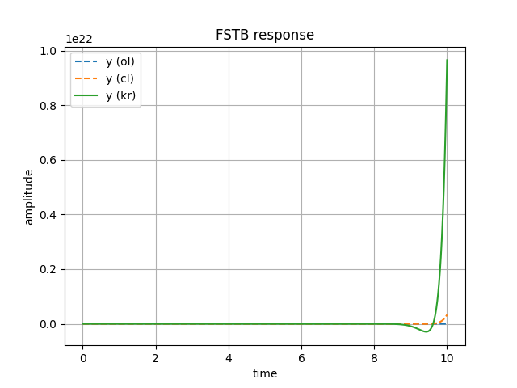\
Can see that the response diverges away from 0, meaning that the system is unstable.\
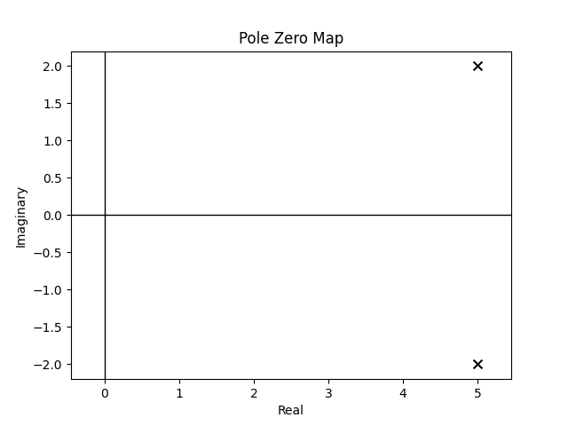\
Can see that since the poles are on the left side of the complex plane, the output is unstable.

# State Observer (Luenberger Observer)
Usually the user will not have the measurements of all the states to a real system. Using the measurements of the input and output of the real system the state observer can estimate all the internal state of the real system.\
\
The equations for the system. Hat means estimations rather than actual.

$$ \dot{\hat{x}} = A \hat{x} + Bu + L(y - \hat{y}) $$

$$ \hat{y} = C \hat{x} $$

---

$$ \dot{\hat{x}} = A \hat{x} + Bu + Ly - L \hat{y} $$

Subtituting $\hat{y} = C \hat{x}$

$$ \dot{\hat{x}} = A \hat{x} + Bu + Ly - LC \hat{x} $$

$$
\dot{\hat{x}} = (A-LC) \hat{x} +
\begin{bmatrix} B & L \end{bmatrix}
\begin{bmatrix} u \\\ y \end{bmatrix}
$$

$$ [A-LC] $$
becomes the new A matrix, 

$$ \begin{bmatrix} B & L \end{bmatrix} $$

becomes the new B matrix, while 

$$ \begin{bmatrix} u \\\ y \end{bmatrix} $$

becomes the new u matrix. 

C can be identity due to knowing all the state estimations and D becomes a matrix of 0s. The system A has given fixed eigvenvalues, and now with A-LC can shift the eigenvalues to any user chosen poles.

$$ rank(obsv(A, C)) = 2 $$
therefore the system is observable.

To find the eigenvalues of the plant.

$$ A = \begin{bmatrix} 0 & 1 \\\ -20 & -10 \end{bmatrix} $$

$$ C = \begin{bmatrix} 1 & 0 \end{bmatrix} $$

$$ det[sI - A] = 0 $$

$$ det[\begin{bmatrix} s & 0 \\\ 0 & s \end{bmatrix} - \begin{bmatrix} -L_{1} & 1 \\\ -L_{2}-20 & -10 \end{bmatrix}] = 0 $$

$$ s^2 + 10s +20 = 0 $$

$$ s = -5 \pm \sqrt{5} $$

$$ s = -2.76, -7.24 $$

To find the new characteristics of the A matrix where $A-LC$

$$ det[sI - (A-LC)] = 0 $$

$$ s^2 + (10 + L_1)s + (10L_1 + L_2 + 20) = 0 $$

The poles chosen to be $-5 \pm 2j$. 

$$ (s+5-2j)(s+5+2j) = 0 $$

$$ s^2 + 10s + 29 = 0 $$

The L gain values are

$$ 10 + L_1 = 10 $$

$$ 10L_1 + L_2 + 20 = 29 $$

$$ L = \begin{bmatrix} L_{1} \\\ L_{2} \end{bmatrix} = \begin{bmatrix} 0 \\\ 9 \end{bmatrix} $$

Error is defined as $e = x - \hat{x}$

$$ \dot{e} = \dot{x} - \dot{\hat{x}} $$

$$ \dot{e} = Ax + Bu - A\hat{x} -Bu-Ly + L\hat{y} $$

$$ \dot{e} = A(x - \hat{x}) - LCx + LC\hat{x} $$

$$ \dot{e} = A(x - \hat{x}) - LC(x-\hat{x}) $$

$$ \dot{e} = (A-LC)e $$

This shows that the estimation states will converge to the actual states if the eigenvalues of $A-LC$ is on the left side of the complex plane. 

With mass = 10\
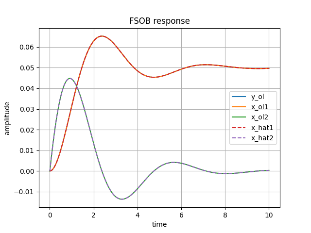\
Can see the estimated states $\hat{x}$ following the actual states x open loop. This example did not introduce disturbances or noise into the model so the estimation model matches the plant model easily. The estimator only took in the input u and output y (position) and can derive all the states including velocity.\
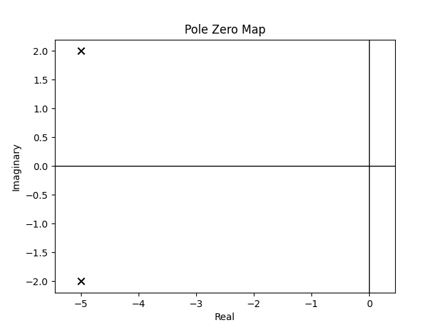\
Chosen poles to be $-5 \pm 2j$

With mass = 10 and initial conditions of 

$$ x_0 = \begin{bmatrix}0.5 \\\ -0.5\end{bmatrix} $$

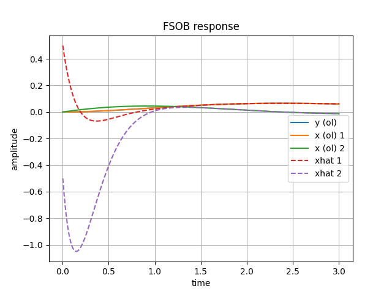\
Can see with arbitrary picked initial conditions the estimated states will still converge to the true states.\
\
Chosen poles to be $-5 \pm 2j$

With mass = 10 and initial conditions of 

$$ x_0 = \begin{bmatrix}0.5 \\\ -0.5\end{bmatrix} $$

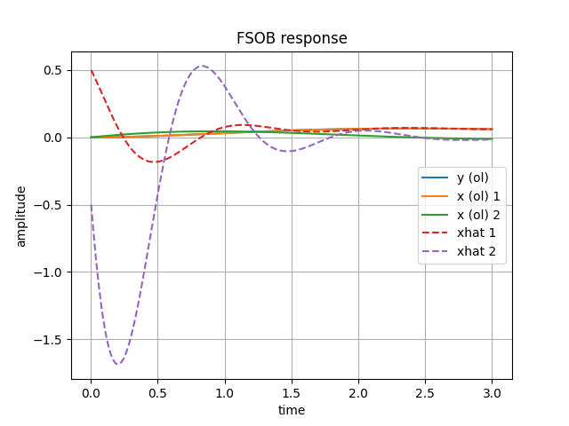\
With poorly chosen poles, the estimated states becomes more oscillatory.\
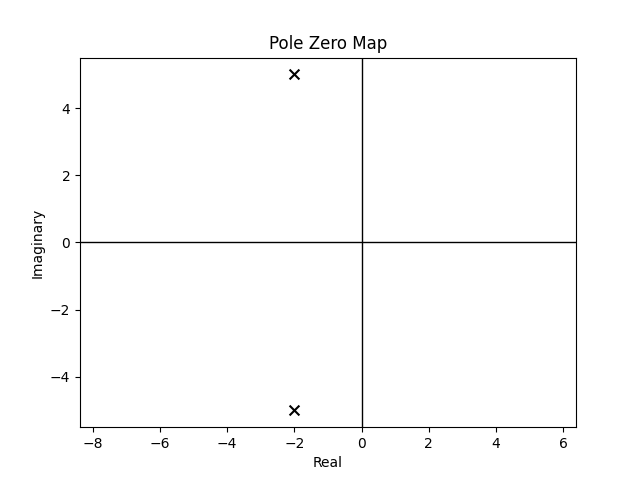\
Chosen poles to be $-2 \pm 5j$

With mass = 10 and initial conditions of 

$$ x_0 = \begin{bmatrix}0.5 \\\ -0.5\end{bmatrix} $$

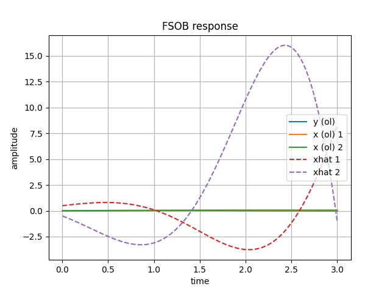\
Can see the estimated states diverge from true states due to unstable poles\
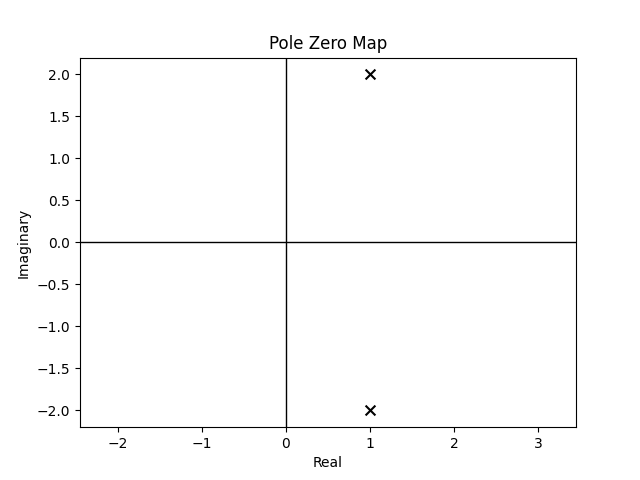\
Chosen poles to be $1 \pm 2j$

# Observer State Feedback

The state space model equations

$$ \dot{x} = Ax + Bu $$

$$ y = Cx + Du $$

control law with estimated states

$$ u = -k \hat{x} + K_r r $$

observer equations

$$ \dot{\hat{x}} = A \hat{x} + Bu + L(y - \hat{y}) $$

$$ \hat{y} = C \hat{x} + Du $$

Error is defined to be $e = x - \hat{x}$, the difference between actual states and estimated states.

---

Substituting u in model equations

$$ \dot{x} = Ax - BK \hat{x} + BK_r r $$

Sutstituting $\hat{x} = x - (x - \hat{x})$

$$ \dot{x} = Ax - BKx + BK(x-\hat{x}) + BK_r r $$

$$ \dot{x} = (A-BK)x + BKe + BK_r r $$

--- 

Substituting y and $\hat{y}$ in observer equations

using $\dot{e} = \dot{x} - \dot{\hat{x}}$

$$ \dot{e} = Ax + Bu - A\hat{x} - Bu -Ly + L\hat{y} $$

$$ \dot{e} = A(x - \hat{x}) - LCx + LC\hat{x} $$

$$ \dot{e} = A(x - \hat{x}) - LC(x-\hat{x}) $$

$$ \dot{e} = (A-LC)e $$

---

The new combined system states becomes

$$
\begin{aligned}
\begin{bmatrix} \dot{x} \\\ \dot{e} \end{bmatrix} =
\begin{bmatrix} A-BK & BK \\\ 0 & A-LC \end{bmatrix}
\begin{bmatrix} x \\\ e \end{bmatrix} +
\begin{bmatrix} BK_r \\\ 0 \end{bmatrix}
\begin{bmatrix} r \end{bmatrix}
\end{aligned}
$$

$$
\begin{aligned} y =
\begin{bmatrix} C & 0 \end{bmatrix}
\begin{bmatrix} x \\\ e \end{bmatrix} +
\begin{bmatrix} D \end{bmatrix}
\begin{bmatrix} r \end{bmatrix}
\end{aligned}
$$

The new states now includes position, velocity, the difference between actual and estimated position, and the difference between actual and estimated velocity.

$$ rank(ctrb(A, B)) = 2 $$

$$ rank(obsv(A, C)) = 2 $$

The system is both controllable and observable.

With m = 10
\
Feedback poles at $ -1 \pm 2i $ and Observer poles at $ -4 \pm 2i $

With m = 10, sigma = 0.1 and mean = 0 noise added into output y of state model.
\
Feedback poles at $ -1 \pm 2i $ and Observer poles at $ -4 \pm 2i $
